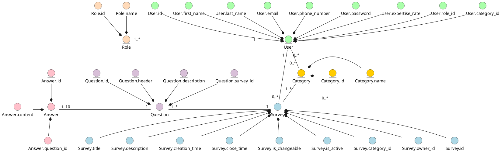
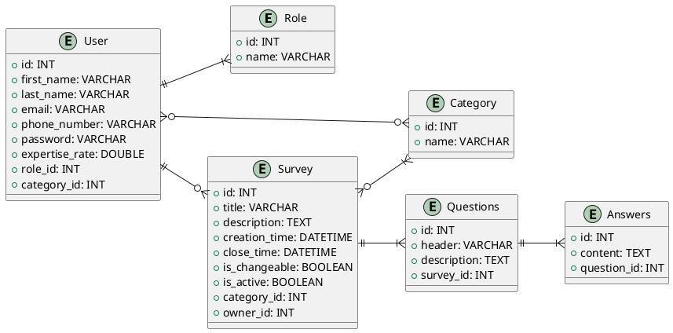

# Проєктування бази даних

## Короткий зміст: 
- [модель бізнес-об'єктів](#BusinessObjectsModel)
- [ER-модель](#ERModel)
- [реляційна схема](#RelationalSchema)

 

## Модель бізнес-об'єктів
**Модель бізнес-об'єктів** - це опис системи, в рамках якої відображаються всі об’єкти (сутності) даної системи. [[1]](https://economyandsociety.in.ua/journals/7_ukr/82.pdf)

## ER-модель
**ER-модель** описує сутності системи та визначає зв'язки між ними. [[2]](https://en.wikipedia.org/wiki/Entity%E2%80%93relationship_model)

## Реляційна схема
**Реляційна схема** - це набір таблиць, кожна з яких відповідає за одну з сутностей реляційної бази даних, та зв'язків між ними. Реляційна схема використовується для представлення реляційної бази даних. [[3]](https://www.sciencedirect.com/topics/computer-science/relational-schema#:~:text=A%20relational%20schema%20is%20a,applications%20belong%20to%20one%20schema.)

## Посилання
1. [Бізнес-моделі підприємства: еволюція та класифікація](https://economyandsociety.in.ua/journals/7_ukr/82.pdf)
2. [Entity–relationship model](https://en.wikipedia.org/wiki/Entity%E2%80%93relationship_model)
3. [Relational Schemas](https://www.sciencedirect.com/topics/computer-science/relational-schema#:~:text=A%20relational%20schema%20is%20a,applications%20belong%20to%20one%20schema.)