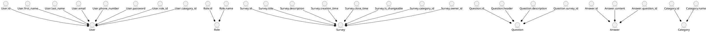

# Проєктування бази даних

В рамках проєкту розробляється: 
- модель бізнес-об'єктів 
- ER-модель
- реляційна схема

## Модель бізнес-об'єктів

```plantuml
@startuml

entity User
entity User.id
entity User.first_name
entity User.last_name
entity User.email
entity User.phone_number
entity User.password
entity User.role_id
entity User.category_id

User.id --* User
User.first_name --* User
User.last_name --* User
User.email --* User
User.phone_number --* User
User.password --* User
User.role_id --* User
User.category_id --* User

entity Role
entity Role.id
entity Role.name

Role.id --* Role
Role.name --* Role

entity Survey
entity Survey.id
entity Survey.title
entity Survey.description
entity Survey.creation_time
entity Survey.close_time
entity Survey.is_changeable
entity Survey.category_id
entity Survey.owner_id

Survey.id --* Survey
Survey.title --* Survey
Survey.category_id --* Survey
Survey.description --* Survey
Survey.creation_time --* Survey
Survey.close_time --* Survey
Survey.is_changeable --* Survey
Survey.owner_id --* Survey

entity Question
entity Question.id
entity Question.header
entity Question.description
entity Question.survey_id

Question.id --* Question
Question.header --* Question
Question.description --* Question
Question.survey_id --* Question

entity Answer
entity Answer.id
entity Answer.content
entity Answer.question_id

Answer.id --* Answer
Answer.content --* Answer
Answer.question_id --* Answer

entity Category
entity Category.id
entity Category.name

Category.id --* Category
Category.name --* Category

@enduml
```
