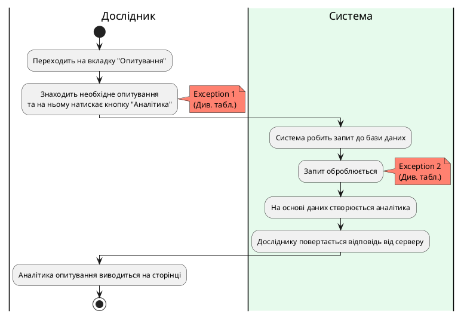
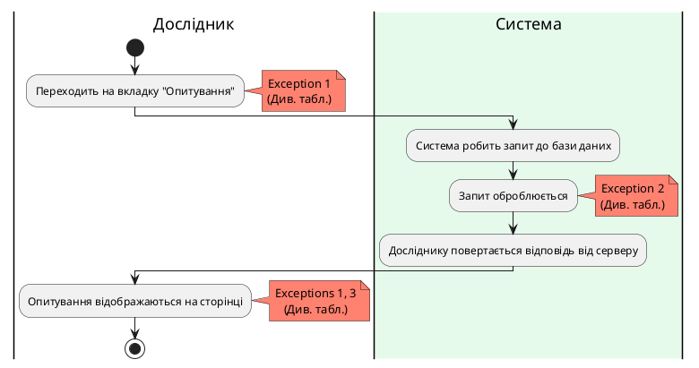

### Діаграма активності для GetSurveyAnalytics

| ID  | GetSurveyAnalytics                                          |
| :------------- |:-------------------------------------------------------------------------------------------------|
| НАЗВА | Отримати аналітику опитування                                                                    |
| УЧАСНИКИ | Дослідник, система                                                                               |
| ПЕРЕДУМОВИ | Дослідник вже має створене опитування.                                                           |
| РЕЗУЛЬТАТ | Отримується аналітика за результатами опитування.                                                |
| ВИКЛЮЧНІ СИТУАЦІЇ | 1. Багаторазове швидке натискання на кнопку "Аналітика". 2. Не вдалося отримати дані з бази. |

**Діаграма активності отримання аналітики опитування**

### Діаграма активності для ShowCreatedSurveys

| ID  | ShowCreatedSurveys                                                                                                                                   |
| :------------- |:------------------------------------------------------------------------------------------------------------------------------------------------------------------------------------------|
| НАЗВА | Показати створені опитування                                                                                                                                                              |
| УЧАСНИКИ | Дослідник, система                                                                                                                                                                        |
| ПЕРЕДУМОВИ | Дослідник вже авторизований у системі.                                                                                                                                                    |
| РЕЗУЛЬТАТ | Показуються усі створені опитування.                                                                                                                                                      |
| ВИКЛЮЧНІ СИТУАЦІЇ | 1. У користувача зник інтернет. 2. Не вдалося отримати дані з бази.  3. Запит на створення нового опитування не встиг обробитись, тому щойно створене опитування не відображається. |

**Діаграма активності показу створених опитувань**

