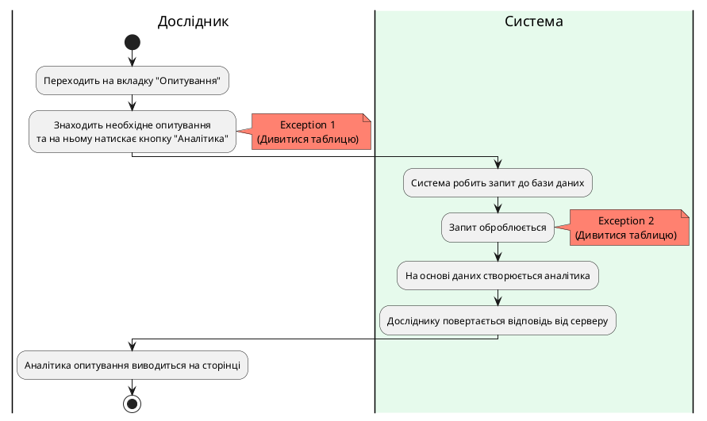

### Діаграма активності для GetSurveyAnalytics

| ID  | GetSurveyAnalytics                                          |
| :------------- |:-------------------------------------------------------------------------------------------------|
| НАЗВА | Отримати аналітику опитування                                                                    |
| УЧАСНИКИ | Дослідник                                                                                        |
| ПЕРЕДУМОВИ | Дослідник вже має створене опитування.                                                           |
| РЕЗУЛЬТАТ | Отримується аналітика за результатами опитування.                                                |
| ВИКЛЮЧНІ СИТУАЦІЇ | 1. Багаторазове швидке натискання на кнопку "Аналітика". 2. Не вдалося отримати дані з бази. |

**Діаграма активності отримання аналітики опитування**

