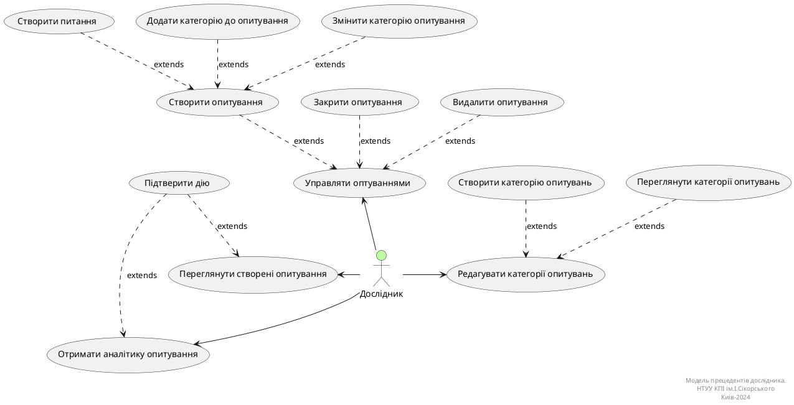
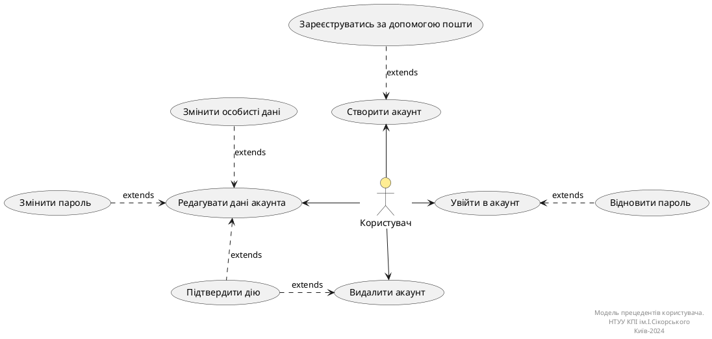
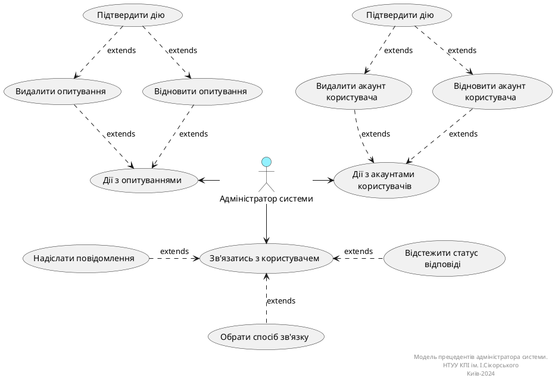
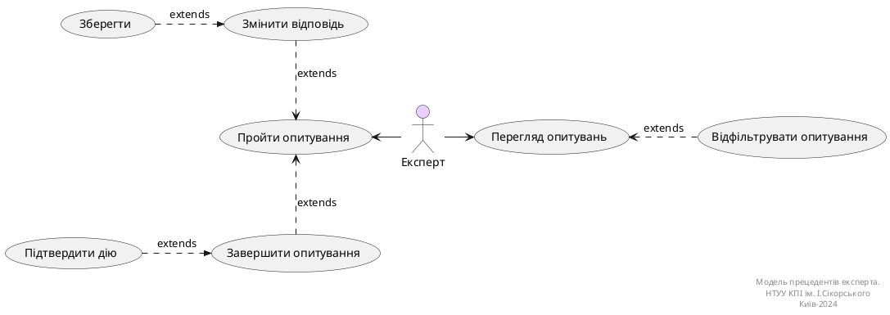

# Розроблення функціональних вимог до системи

## Загальна діаграма прецедентів

**Діаграми прецедентів бізнес акторів**

## Діаграми use case
### Use case діаграма дослідника

**Діаграма прецедентів дослідника**

### Діаграма use case для незареєстрованного користувача

**Діаграма прецедентів користувача**

### Діаграма use case для адміністратора

**Діаграма прецедентів адміністратора**

### Діаграма use case для експерта

**Діаграма прецедентів експерта**

