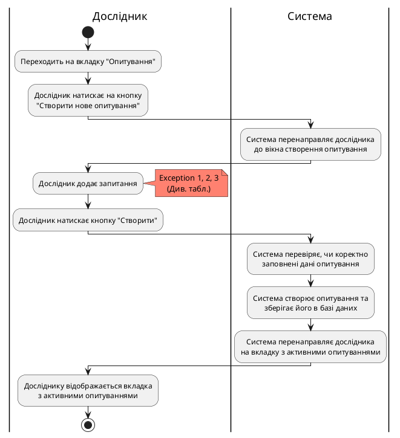
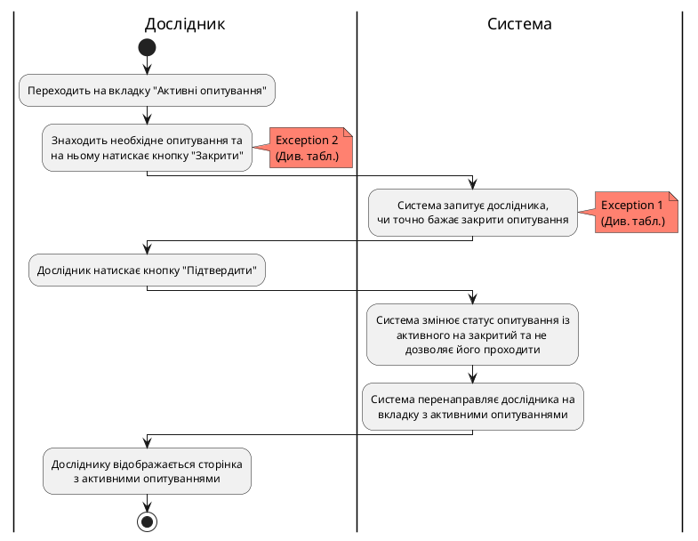
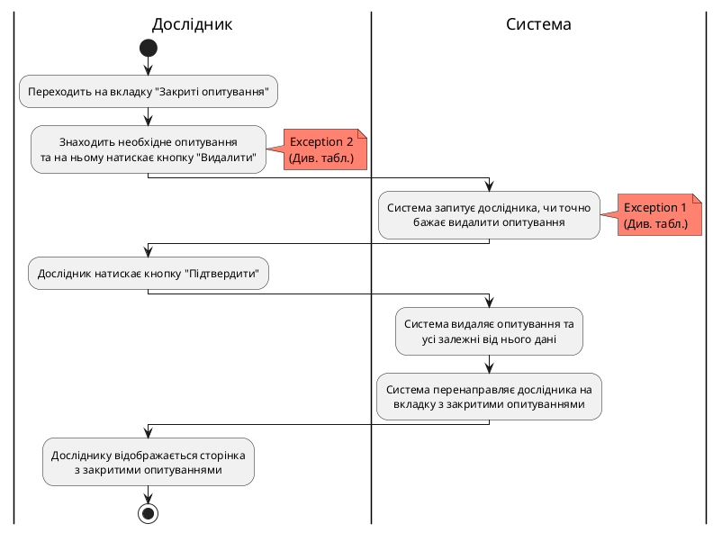

### Діаграма активності для CreateSurvey

| ID  | CreateSurvey                                                                                                                                                   |
| :------------- |:----------------------------------------------------------------------------------------------------------------------------------------------------------------------------------------------|
| НАЗВА | Створити опитування                                                                                                                                                                           |
| УЧАСНИКИ | Дослідник, система                                                                                                                                                                            |
| ПЕРЕДУМОВИ | Дослідник має намір створити опитування та вже авторизований у системі.                                                                                                                       |
| РЕЗУЛЬТАТ | Створення опитування.                                                                                                                                                                         |
| ВИКЛЮЧНІ СИТУАЦІЇ | 1. Дослідник не заповнив усі поля запитань та варіантів відповідей, що додав. 2. Запитання містить однакові варіанти відповідей. 3. Дослідник не додав жодного питання до опитування. |

### Діаграма активності для CloseSurvey

| ID                | CloseSurvey                                                                                                                                       |
|:------------------|:--------------------------------------------------------------------------------------------------------------------------------------------------------------------------------|
| НАЗВА             | Закрити опитування                                                                                                                                                              |
| УЧАСНИКИ          | Дослідник, система                                                                                                                                                              |
| ПЕРЕДУМОВИ        | Дослідник вже має створене опитування, яке хоче закрити.                                                                                                                        |
| РЕЗУЛЬТАТ         | Закриття опитування (більше не є можливим для проходження).                                                                                                                     |
| ВИКЛЮЧНІ СИТУАЦІЇ | 1. При запиті "Ви точно бажаєте закрити опитування?" обрати варіант "Ні". 2. Швидко натискає кнопку другий раз до того, як запит після першого натискання встиг обробитися. |

### Діаграма активності для RemoveSurvey

| ID  | RemoveSurvey                                                                                                                                      |
| :------------- |:---------------------------------------------------------------------------------------------------------------------------------------------------------------------------------|
| НАЗВА | Видалити опитування                                                                                                                                                              |
| УЧАСНИКИ | Дослідник, система                                                                                                                                                               |
| ПЕРЕДУМОВИ | Дослідник вже має закрите опитування та бажання його видалити.                                                                                                                   |
| РЕЗУЛЬТАТ | Видалення опитування.                                                                                                                                                            |
| ВИКЛЮЧНІ СИТУАЦІЇ | 1. При запиті "Ви точно бажаєте видалити опитування?" обрати варіант "Ні". 2. Швидко натискає кнопку другий раз до того, як запит після першого натискання встиг обробитися. |

