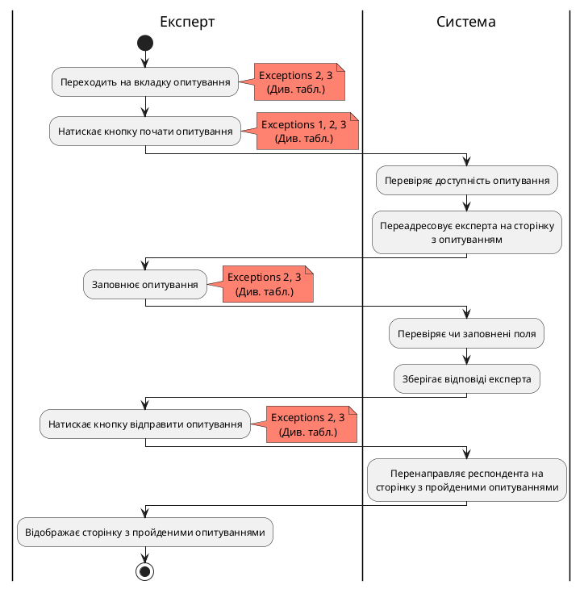
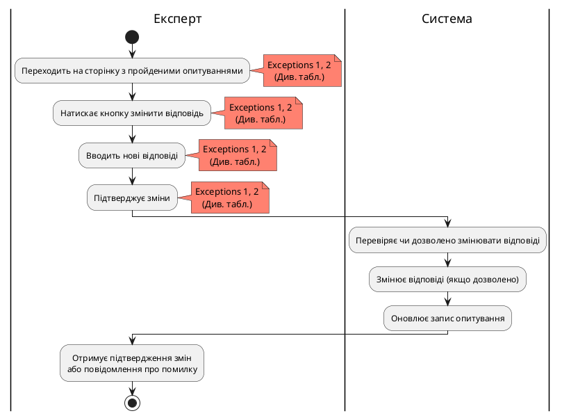

# Розроблення функціональних вимог до системи

### Діаграма активності для TakeSurvey
| ID  | TakeSurvey                                                                                                                                                                                                                                 |
| :------------- |:------------------------------------------------------------------------------------------------------------------------------------------------------------------------------------------------------------------------------------------------------------------------|
| НАЗВА | Отримати аналітику опитування                                                                                                                                                                                                                                           |
| УЧАСНИКИ | Експерт, система                                                                                                                                                                                                                                                        |
| ПЕРЕДУМОВИ | Експерт має бути зареєстрований у системі.                                                                                                                                                                                                                              |
| РЕЗУЛЬТАТ | Експерту показується опитування, та він може його проходити.                                                                                                                                                                                                            |
| ВИКЛЮЧНІ СИТУАЦІЇ | 1. Експерт двічі натиснув на кнопку "Почати опитування".  2. У користувача зник інтернет  3. Користувач випадково оновив сторінку                                                                                                                                 |
| ОСНОВНИЙ СЦЕНАРІЙ | 1. Експерт натискає кнопку почати опитування. 2. Експерта переадресовує на сторінку з опитуванням. 3. Експерт заповнює опитування. 4. Експерт натискає кнопку відправити опитування. 5. Експерта перенаправляє на сторінку з пройденими опитуваннями.   |

### Діаграма активності для ChangeAnswer
| ID  | ChangeAnswer                                                                                                                                    |
| :------------- |:-------------------------------------------------------------------------------------------------------------------------------------------------------------------------------|
| НАЗВА | Отримати аналітику опитування                                                                                                                                                  |
| УЧАСНИКИ | Експерт, система                                                                                                                                                               |
| ПЕРЕДУМОВИ | Ця можливість повинна бути дозволена автором опитування.                                                                                                                       |
| РЕЗУЛЬТАТ | Відповідь експерта змінюється.                                                                                                                                                 |
| ВИКЛЮЧНІ СИТУАЦІЇ | 1. У експерта зник інтернет.  2. Експерт випадково оновив сторінку.                                                                                                         |
| ОСНОВНИЙ СЦЕНАРІЙ | 1. Експерт намагається змінити відповідь. 2. Перевіряється, чи дозволена така можливість.  3. Якщо змінення відповідей дозволено, то зберігається нова відповідь.  |

