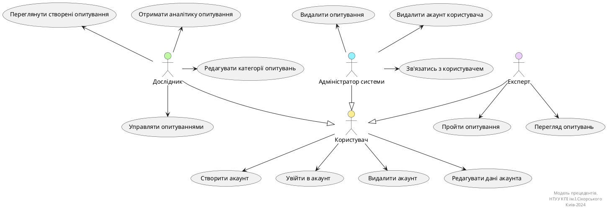
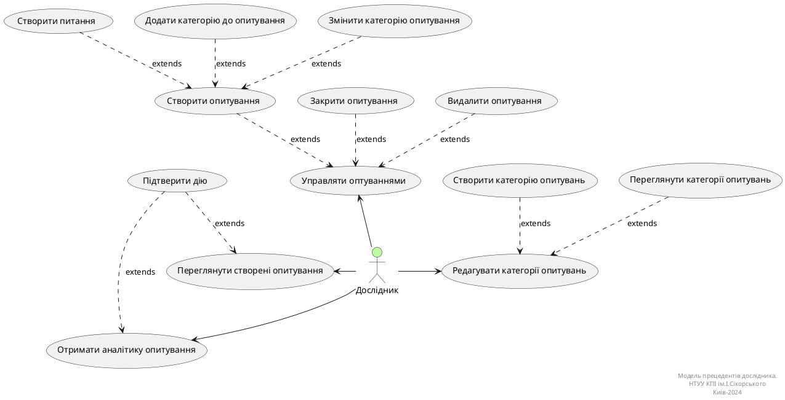

# Розроблення функціональних вимог до системи

## Загальна діаграма прецедентів

**Діаграма прецедентів**

## Діаграми use case
### Use case діаграма дослідника

**Діаграма прецедентів дослідника**

