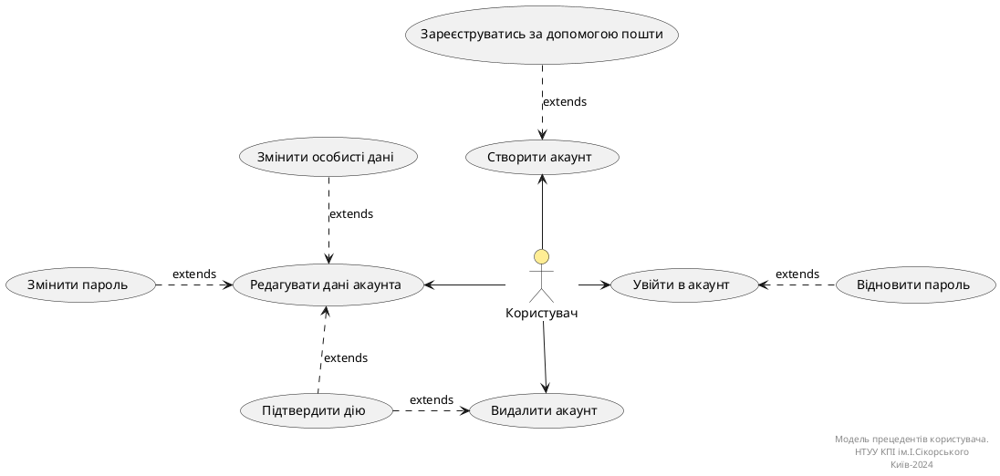

# Розроблення функціональних вимог до системи

### Діаграма use case для незареєстрованного користувача

```plantuml
@startuml
    actor "Користувач" as User #ffed94

    usecase "Створити акаунт" as UC_1.1
    usecase "Увійти в акаунт" as UC_1.2  
    usecase "Видалити акаунт" as UC_1.3
    usecase "Редагувати дані акаунта" as UC_1.4
    
    usecase "Зареєструватись за допомогою пошти" as UC_1.1.1

    usecase "Відновити пароль" as UC_1.2.1
    
    usecase "Підтвердити дію" as UC_1.34.1
    
    usecase "Змінити пароль" as UC_1.4.1
    usecase "Змінити особисті дані" as UC_1.4.2
    
    User -up-> UC_1.1
    User -right-> UC_1.2
    User -down-> UC_1.3
    User -left-> UC_1.4
    
    UC_1.1.1 ..> UC_1.1 :extends
    UC_1.2.1 .left.> UC_1.2 :extends
    UC_1.34.1 .right.> UC_1.3 :extends
    UC_1.34.1 .up.> UC_1.4 :extends
    UC_1.4.1 .right.> UC_1.4 :extends
    UC_1.4.2 ..> UC_1.4 :extends
    
    right footer
        Модель прецедентів користувача.
        НТУУ КПІ ім.І.Сікорського
        Київ-2024
    end footer
    
@enduml
```

**Діаграма прецедентів користувача**

