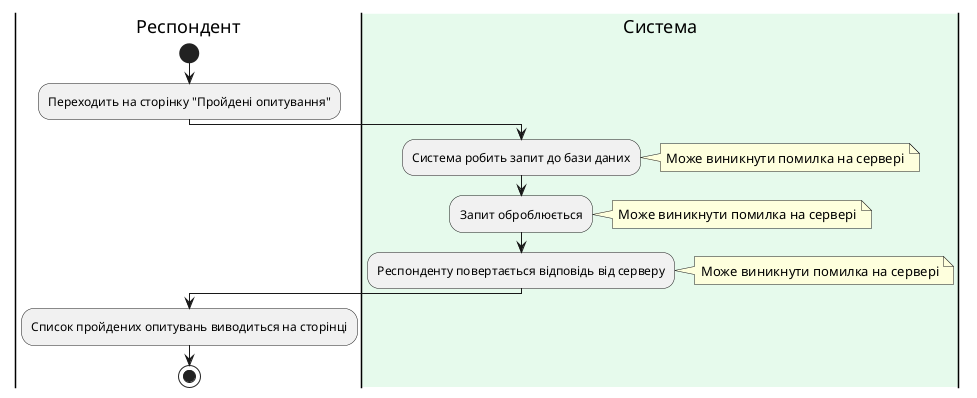

### Діаграма активності для ShowTakenSurveys

| ID  | ShowTakenSurveys                                                                                                                                                                |
| :------------- |:-------------------------------------------------------------------------------------------------------------------------------------------------------------------------------------------------------------------|
| НАЗВА | Показ пройдених опитуваннь.                                                                                                                                                                                        |
| УЧАСНИКИ | Респондент, система                                                                                                                                                                                                |
| ПЕРЕДУМОВИ | Респондент авторизований у систему.                                                                                                                                                                                |
| РЕЗУЛЬТАТ | Респонденту виводяться всі пройдені опитування у вікні.                                                                                                                                                            |
| ВИКЛЮЧНІ СИТУАЦІЇ | Помилка на сервері.                                                                                                                                                                                                |

**Діаграма активності показу пройдених опитувань**

