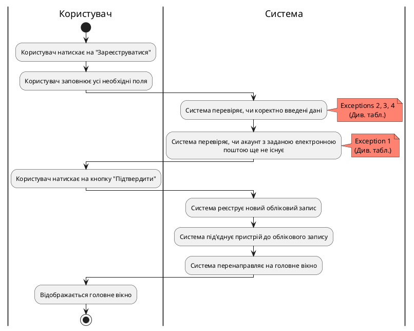
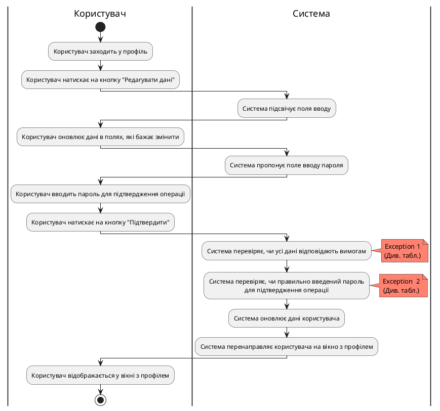
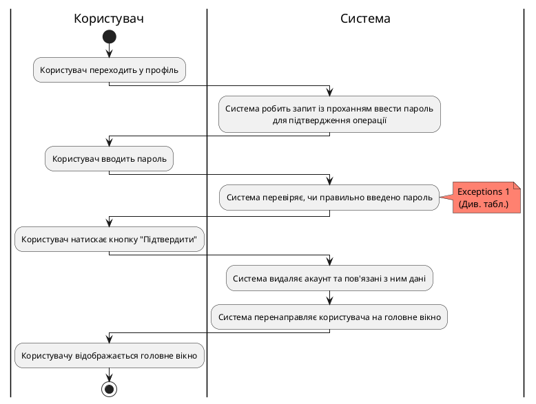

# Розроблення функціональних вимог до системи

 

## Діаграми активностей

### Діаграма активності для CreateUserAccount
| ID  | CreateUserAccount                                                                                                                                                                                                                                                                                                                                              |
| :------------- |:---------------------------------------------------------------------------------------------------------------------------------------------------------------------------------------------------------------------------------------------------------------------------------------------------------------------------------------------------------------------------------------------------|
| НАЗВА | Створити акаунт користувача                                                                                                                                                                                                                                                                                                                                                                        |
| УЧАСНИКИ | Дослідник, експерт, система                                                                                                                                                                                                                                                                                                                                                                        |
| ПЕРЕДУМОВИ | Користувач попередньо не має зареєстрованого акаунта в системі MESS.                                                                                                                                                                                                                                                                                                                               |
| РЕЗУЛЬТАТ | Реєстрація облікового запису користувача.                                                                                                                                                                                                                                                                                                                                                          |
| ВИКЛЮЧНІ СИТУАЦІЇ | 1. Обліковий запис, зареєстрований за цією поштою, вже існує. 2. Не всі обов'язкові дані заповнені. 3. Пароль не відповідає вимогам. 4. Поля "Пароль" та "Підтвердіть пароль" не збігаються.                                                                                                                                                                                           |

## Діаграма активності для ChangeUserData
| ID  | ChangeUserData                                                                                                                                                                                                                                                                                                                                                                                                                                                                                                                                                                                     |
| :------------- |:------------------------------------------------------------------------------------------------------------------------------------------------------------------------------------------------------------------------------------------------------------------------------------------------------------------------------------------------------------------------------------------------------------------------------------------------------------------------------------------------------------------------------------------------------------------------------------------------------------------------------------|
| НАЗВА | Редагувати дані акаунта                                                                                                                                                                                                                                                                                                                                                                                                                                                                                                                                                                                                             |
| УЧАСНИКИ | Дослідник, експерт, система                                                                                                                                                                                                                                                                                                                                                                                                                                                                                                                                                                                                         |
| ПЕРЕДУМОВИ | Користувач має створений обліковий запис та авторизований у системі.                                                                                                                                                                                                                                                                                                                                                                                                                                                                                                                                                                |
| РЕЗУЛЬТАТ | Оновлення даних облікового запису користувача.                                                                                                                                                                                                                                                                                                                                                                                                                                                                                                                                                                                      |
| ВИКЛЮЧНІ СИТУАЦІЇ | 1. Користувач намагається змінити дані на ті, які не відповідають вимогам. 2. Користувач увів неправильний пароль для підтвердження операції.                                                                                                                                                                                                                                                                                                                                                                                                                                                                                   |

## Діаграма активності для RemoveUserAccount
| ID  | RemoveUserAccount                                                                                                                                                                                                                                                                                                                                                                               |
| :------------- |:------------------------------------------------------------------------------------------------------------------------------------------------------------------------------------------------------------------------------------------------------------------------------------------------------------------------------------------------------------------------------------------------------------------------------------|
| НАЗВА | Видалити акаунт користувача                                                                                                                                                                                                                                                                                                                                                                                                         |
| УЧАСНИКИ | Дослідник, експерт, система                                                                                                                                                                                                                                                                                                                                                                                                         |
| ПЕРЕДУМОВИ | Користувач має створений обліковий запис та авторизований у системі.  Має бажання видалити обліковий запис.                                                                                                                                                                                                                                                                                                                     |
| РЕЗУЛЬТАТ | Видалення облікового запису користувача.                                                                                                                                                                                                                                                                                                                                                                                            |
| ВИКЛЮЧНІ СИТУАЦІЇ | 1. Користувач увів неправильний пароль для підтвердження операції.                                                                                                                                                                                                                                                                                                                                                                  |

