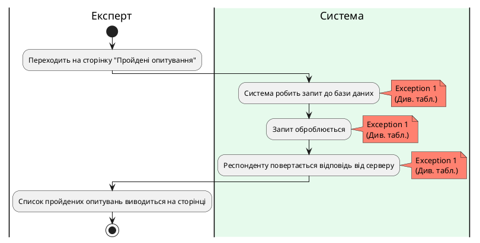

### Діаграма активності для ShowTakenSurveys

| ID  | ShowTakenSurveys  |
| :------------- |:-----------------------------------------------------|
| НАЗВА | Показ пройдених опитуваннь.                          |
| УЧАСНИКИ | Експерт, система                                     |
| ПЕРЕДУМОВИ | Експерт авторизований у систему.                     |
| РЕЗУЛЬТАТ | Експерту виводяться всі пройдені опитування у вікні. |
| ВИКЛЮЧНІ СИТУАЦІЇ | 1. Помилка на сервері.                               |

**Діаграма активності показу пройдених опитувань**

