# Розроблення функціональних вимог до системи

## Загальна діаграма прецедентів

**Діаграми прецедентів бізнес акторів**

## Діаграми use case
### Use case діаграма дослідника

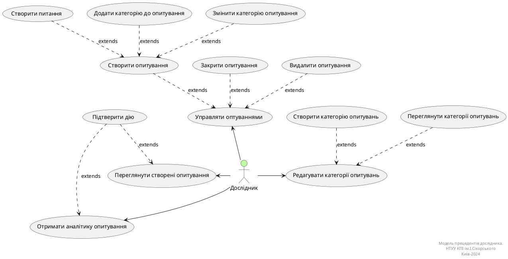
**Діаграма прецедентів дослідника**

### Діаграма use case для незареєстрованного користувача

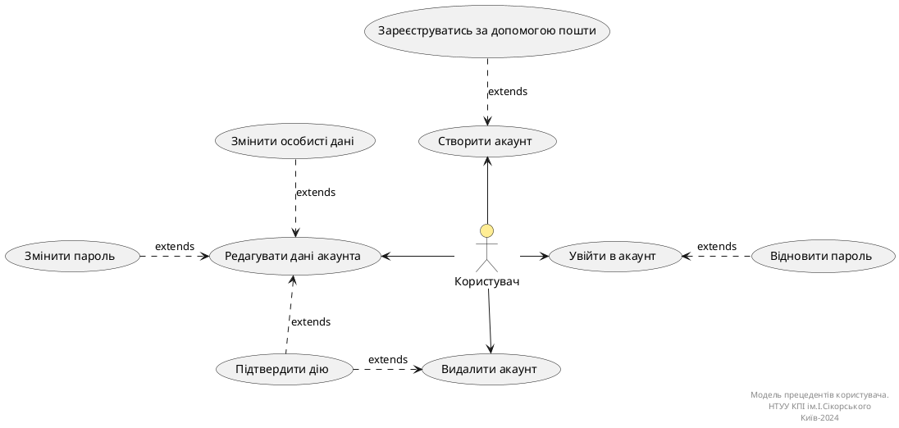

**Діаграма прецедентів користувача**

### Діаграма use case для адміністратора

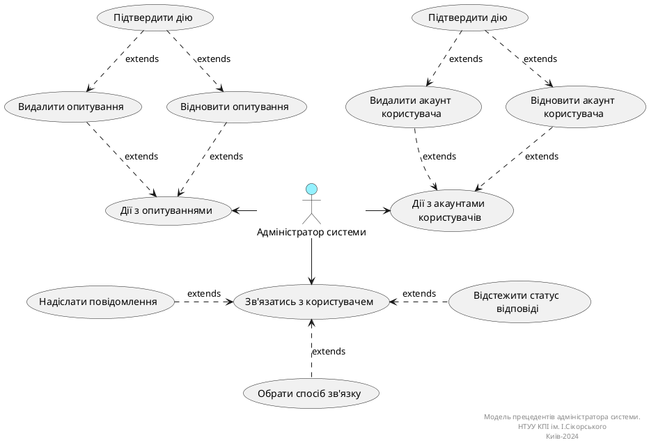

**Діаграма прецедентів адміністратора**

### Діаграма use case для експерта

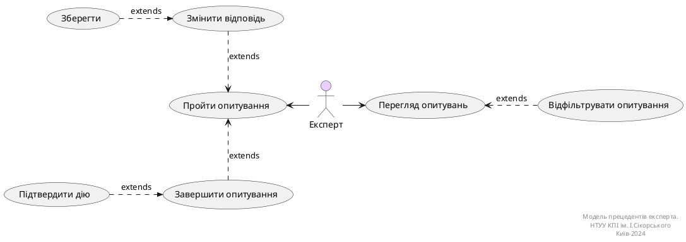

**Діаграма прецедентів експерта**

## Діаграми активностей

### Діаграма активності для CreateUserAccount
| ID  | CreateUserAccount                                                                                                                                                    |
| :------------- |:---------------------------------------------------------------------------------------------------------------------------------------------------------------------------------------------------------|
| НАЗВА | Створити акаунт користувача                                                                                                                                                                              |
| УЧАСНИКИ | Користувач, система                                                                                                                                                                                      |
| ПЕРЕДУМОВИ | Користувач попередньо не має зареєстрованого акаунта в системі MESS.                                                                                                                                     |
| РЕЗУЛЬТАТ | Реєстрація облікового запису користувача.                                                                                                                                                                |
| ВИКЛЮЧНІ СИТУАЦІЇ | 1. Обліковий запис, зареєстрований за цією поштою, вже існує. 2. Не всі обов'язкові дані заповнені. 3. Пароль не відповідає вимогам. 4. Поля "Пароль" та "Підтвердіть пароль" не збігаються. |

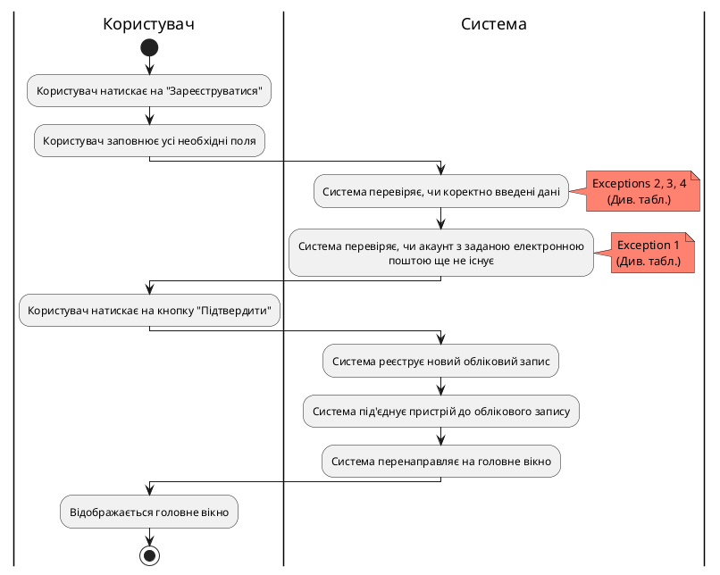

### Діаграма активності для ChangeUserData
  
  
| ID  | ChangeUserData                                                                                                                                                                                                                                                                                                                                                                                                                                                                                                                                                                                     |
| :------------- |:------------------------------------------------------------------------------------------------------------------------------------------------------------------------------------------------------------------------------------------------------------------------------------------------------------------------------------------------------------------------------------------------------------------------------------------------------------------------------------------------------------------------------------------------------------------------------------------------------------------------------------|
| НАЗВА | Редагувати дані акаунта                                                                                                                                                                                                                                                                                                                                                                                                                                                                                                                                                                                                             |
| УЧАСНИКИ | Користувач, система                                                                                                                                                                                                                                                                                                                                                                                                                                                                                                                                                                                                         |
| ПЕРЕДУМОВИ | Користувач має створений обліковий запис та авторизований у системі.                                                                                                                                                                                                                                                                                                                                                                                                                                                                                                                                                                |
| РЕЗУЛЬТАТ | Оновлення даних облікового запису користувача.                                                                                                                                                                                                                                                                                                                                                                                                                                                                                                                                                                                      |
| ВИКЛЮЧНІ СИТУАЦІЇ | 1. Користувач намагається змінити дані на ті, які не відповідають вимогам. 2. Користувач увів неправильний пароль для підтвердження операції.                                                                                                                                                                                                                                                                                                                                                                                                                                                                                   |

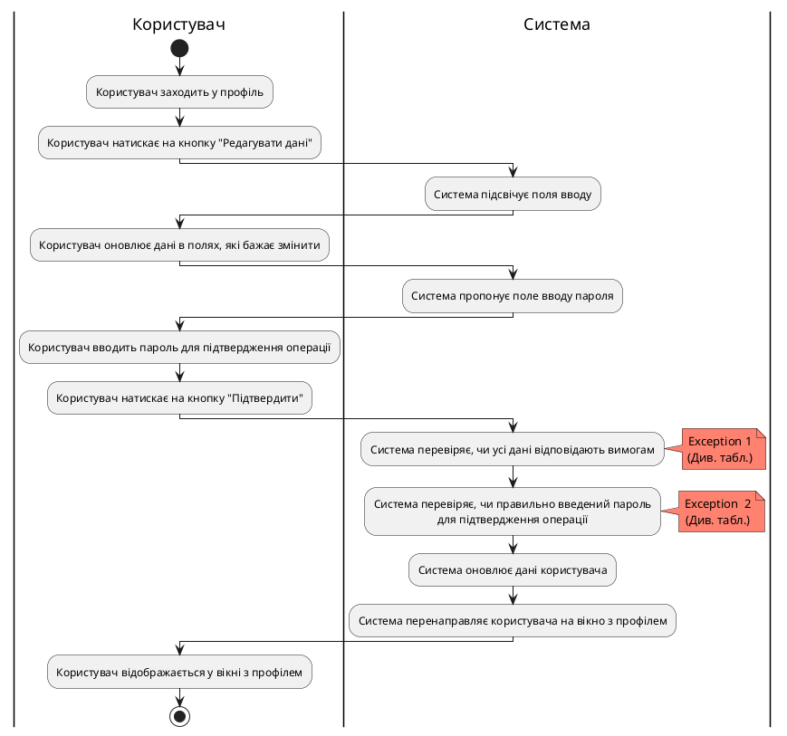

### Діаграма активності для RemoveUserAccount
| ID  | RemoveUserAccount                                                                                                                                                                                                                                                                                                                                                                               |
| :------------- |:------------------------------------------------------------------------------------------------------------------------------------------------------------------------------------------------------------------------------------------------------------------------------------------------------------------------------------------------------------------------------------------------------------------------------------|
| НАЗВА | Видалити акаунт користувача                                                                                                                                                                                                                                                                                                                                                                                                         |
| УЧАСНИКИ | Користувач, система                                                                                                                                                                                                                                                                                                                                                                                                         |
| ПЕРЕДУМОВИ | Користувач має створений обліковий запис та авторизований у системі.  Має бажання видалити обліковий запис.                                                                                                                                                                                                                                                                                                                     |
| РЕЗУЛЬТАТ | Видалення облікового запису користувача.                                                                                                                                                                                                                                                                                                                                                                                            |
| ВИКЛЮЧНІ СИТУАЦІЇ | 1. Користувач увів неправильний пароль для підтвердження операції.                                                                                                                                                                                                                                                                                                                                                                  |

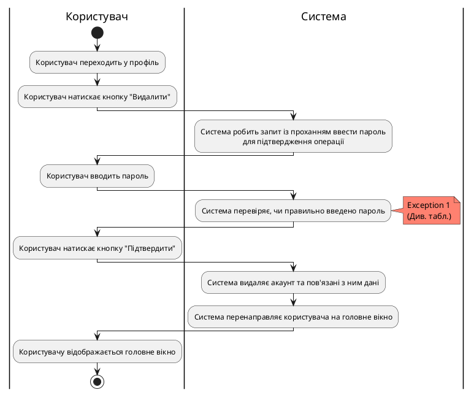

### Діаграма активності для CreateSurvey

| ID  | CreateSurvey                                                                                                                                                   |
| :------------- |:----------------------------------------------------------------------------------------------------------------------------------------------------------------------------------------------|
| НАЗВА | Створити опитування                                                                                                                                                                           |
| УЧАСНИКИ | Дослідник, система                                                                                                                                                                            |
| ПЕРЕДУМОВИ | Дослідник має намір створити опитування та вже авторизований у системі.                                                                                                                       |
| РЕЗУЛЬТАТ | Створення опитування.                                                                                                                                                                         |
| ВИКЛЮЧНІ СИТУАЦІЇ | 1. Дослідник не заповнив усі поля запитань та варіантів відповідей, що додав. 2. Запитання містить однакові варіанти відповідей. 3. Дослідник не додав жодного питання до опитування. |

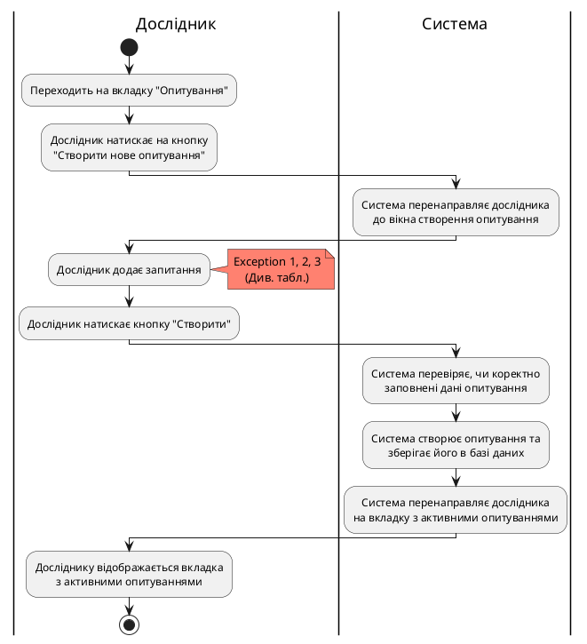

### Діаграма активності для CloseSurvey

| ID                | CloseSurvey                                                                                                                                       |
|:------------------|:--------------------------------------------------------------------------------------------------------------------------------------------------------------------------------|
| НАЗВА             | Закрити опитування                                                                                                                                                              |
| УЧАСНИКИ          | Дослідник, система                                                                                                                                                              |
| ПЕРЕДУМОВИ        | Дослідник вже має створене опитування, яке хоче закрити.                                                                                                                        |
| РЕЗУЛЬТАТ         | Закриття опитування (більше не є можливим для проходження).                                                                                                                     |
| ВИКЛЮЧНІ СИТУАЦІЇ | 1. При запиті "Ви точно бажаєте закрити опитування?" обрати варіант "Ні". 2. Швидко натискає кнопку другий раз до того, як запит після першого натискання встиг обробитися. |

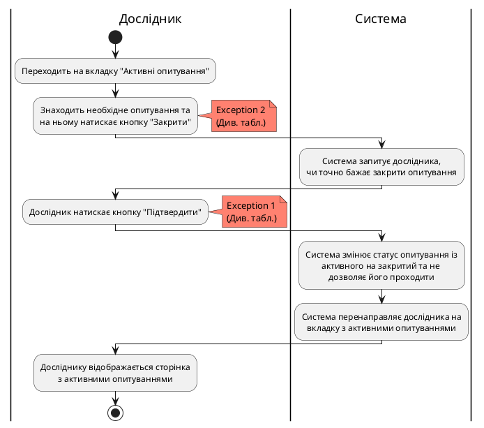

### Діаграма активності для RemoveSurvey

| ID  | RemoveSurvey                                                                                                                                      |
| :------------- |:---------------------------------------------------------------------------------------------------------------------------------------------------------------------------------|
| НАЗВА | Видалити опитування                                                                                                                                                              |
| УЧАСНИКИ | Дослідник, система                                                                                                                                                               |
| ПЕРЕДУМОВИ | Дослідник вже має закрите опитування та бажання його видалити.                                                                                                                   |
| РЕЗУЛЬТАТ | Видалення опитування.                                                                                                                                                            |
| ВИКЛЮЧНІ СИТУАЦІЇ | 1. При запиті "Ви точно бажаєте видалити опитування?" обрати варіант "Ні". 2. Швидко натискає кнопку другий раз до того, як запит після першого натискання встиг обробитися. |

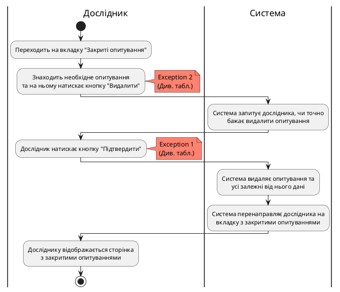

### Діаграма активності для GetSurveyAnalytics

| ID  | GetSurveyAnalytics                                          |
| :------------- |:-------------------------------------------------------------------------------------------------|
| НАЗВА | Отримати аналітику опитування                                                                    |
| УЧАСНИКИ | Дослідник, система                                                                               |
| ПЕРЕДУМОВИ | Дослідник вже має створене опитування.                                                           |
| РЕЗУЛЬТАТ | Отримується аналітика за результатами опитування.                                                |
| ВИКЛЮЧНІ СИТУАЦІЇ | 1. Багаторазове швидке натискання на кнопку "Аналітика". 2. Не вдалося отримати дані з бази. |

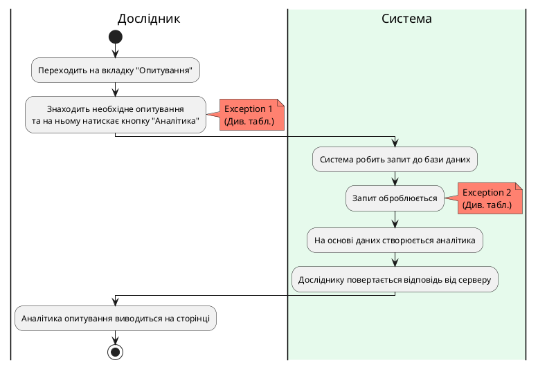
**Діаграма активності отримання аналітики опитування**

### Діаграма активності для ShowCreatedSurveys

| ID  | ShowCreatedSurveys                                                                                                                                   |
| :------------- |:------------------------------------------------------------------------------------------------------------------------------------------------------------------------------------------|
| НАЗВА | Показати створені опитування                                                                                                                                                              |
| УЧАСНИКИ | Дослідник, система                                                                                                                                                                        |
| ПЕРЕДУМОВИ | Дослідник вже авторизований у системі.                                                                                                                                                    |
| РЕЗУЛЬТАТ | Показуються усі створені опитування.                                                                                                                                                      |
| ВИКЛЮЧНІ СИТУАЦІЇ | 1. У користувача зник інтернет. 2. Не вдалося отримати дані з бази.  3. Запит на створення нового опитування не встиг обробитись, тому щойно створене опитування не відображається. |

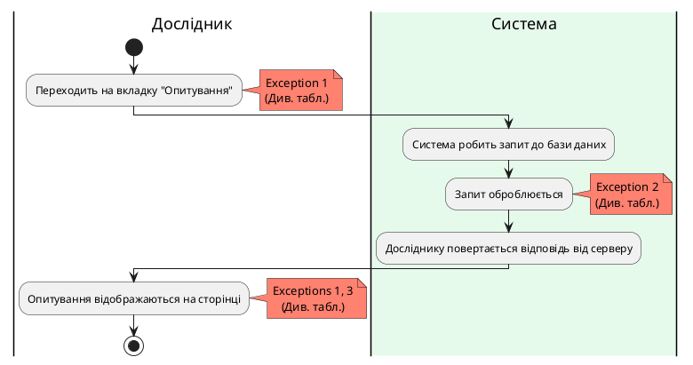
**Діаграма активності показу створених опитувань**

