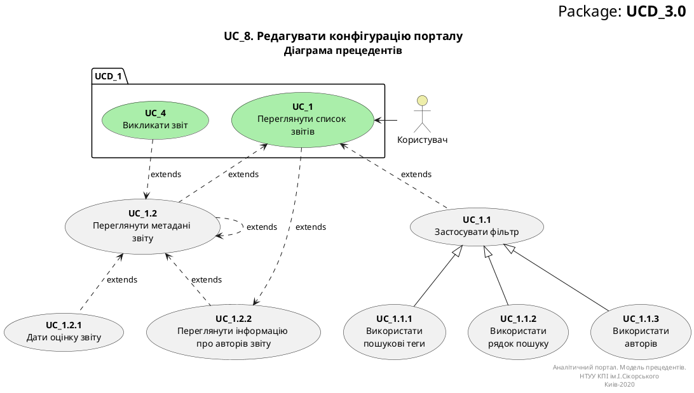
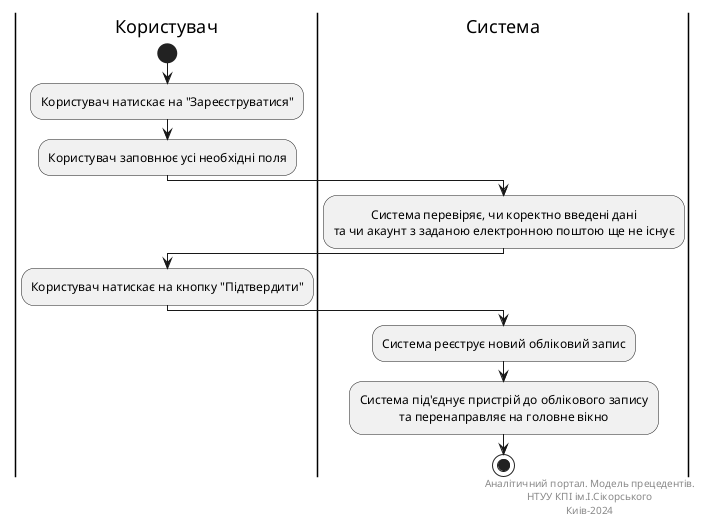
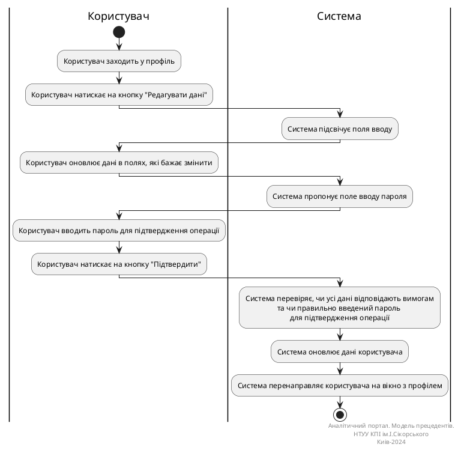
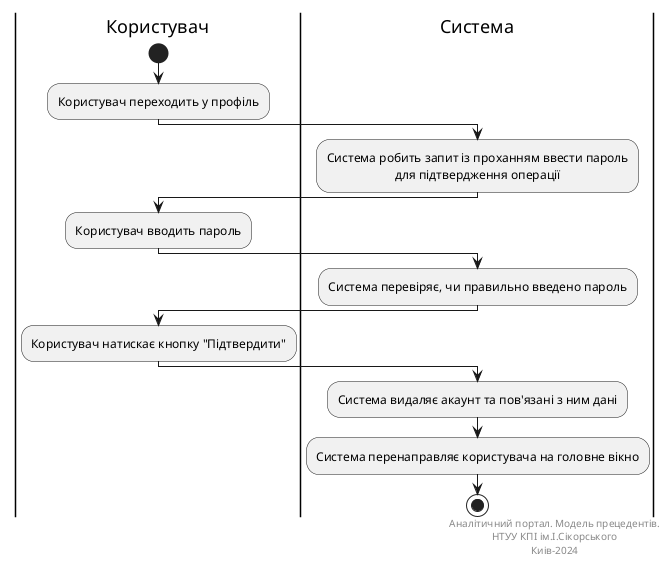

# Розроблення функціональних вимог до системи

## Модель прецедентів

В цьому файлі необхідно перелічити всі документи, розроблені в проекті та дати посилання на них.

*Модель прецедентів повинна містити загальні оглядові діаграми та специфікації прецедентів.*


Вбудовування зображень діаграм здійснюється з використанням сервісу [plantuml.com](https://plantuml.com/). 

В markdown-файлі використовується опис діаграми

```md

<center style="
    border-radius:4px;
    border: 1px solid #cfd7e6;
    box-shadow: 0 1px 3px 0 rgba(89,105,129,.05), 0 1px 1px 0 rgba(0,0,0,.025);
    padding: 1em;"
>

@startuml

@enduml

**Діаграма прецедентів**

</center>
```

яка буде відображена наступним чином

<center style="
    border-radius:4px;
    border: 1px solid #cfd7e6;
    box-shadow: 0 1px 3px 0 rgba(89,105,129,.05), 0 1px 1px 0 rgba(0,0,0,.025);
    padding: 1em;"
    >




**Діаграма прецедентів**


## Діаграми активностей

### Діаграма активності для CreateUserAccount
| ID  | <span id="CreateUserAccount">CreateUserAccount</span>                                                                                                                                                                                                                                                                                                                                              |
| :------------- |:---------------------------------------------------------------------------------------------------------------------------------------------------------------------------------------------------------------------------------------------------------------------------------------------------------------------------------------------------------------------------------------------------|
| НАЗВА | Створити акаунт користувача                                                                                                                                                                                                                                                                                                                                                                        |
| УЧАСНИКИ | Дослідник, експерт                                                                                                                                                                                                                                                                                                                                                                                 |
| ПЕРЕДУМОВИ | Користувач попередньо не має зареєстрованого акаунта в системі MESS.                                                                                                                                                                                                                                                                                                                               |
| РЕЗУЛЬТАТ | Реєстрація облікового запису користувача.                                                                                                                                                                                                                                                                                                                                                          |
| ВИКЛЮЧНІ СИТУАЦІЇ | Обліковий запис, зареєстрований за цією поштою, вже існує.<br/>Не всі обов'язкові дані заповнені.<br/>Пароль не відповідає вимогам.<br/>Поля "Пароль" та "Підтвердіть пароль" не збігаються.<br/>                                                                                                                                                                                                  |
| ОСНОВНИЙ СЦЕНАРІЙ | 1. Користувач натискає на "Зареєструватися".<br/>2. Користувач заповнює усі необхідні поля.<br/>3. Користувач натискає на кнопку "Підтвердити".<br/>4. Система перевіряє, чи коректно введені дані та чи акаунт з заданою електронною поштою ще не існує.<br/>5. Система реєструє новий обліковий запис.<br/>6. Система під'єднує пристрій до облікового запису та перенаправляє на головне вікно. |




## Діаграма активності для ChangeUserData
| ID  | <span id="ChangeUserData">ChangeUserData</span>                                                                                                                                                                                                                                                                                                                                                                                                                                                                                                                                                                                     |
| :------------- |:------------------------------------------------------------------------------------------------------------------------------------------------------------------------------------------------------------------------------------------------------------------------------------------------------------------------------------------------------------------------------------------------------------------------------------------------------------------------------------------------------------------------------------------------------------------------------------------------------------------------------------|
| НАЗВА | Редагувати дані акаунта                                                                                                                                                                                                                                                                                                                                                                                                                                                                                                                                                                                                             |
| УЧАСНИКИ | Дослідник, експерт                                                                                                                                                                                                                                                                                                                                                                                                                                                                                                                                                                                                               |
| ПЕРЕДУМОВИ | Користувач має створений обліковий запис та авторизований у системі.                                                                                                                                                                                                                                                                                                                                                                                                                                                                                                                                                                |
| РЕЗУЛЬТАТ | Оновлення даних облікового запису користувача.                                                                                                                                                                                                                                                                                                                                                                                                                                                                                                                                                                                      |
| ВИКЛЮЧНІ СИТУАЦІЇ | Користувач намагається змінити дані на ті, які не відповідають вимогам.<br/>Користувач увів неправильний пароль для підтвердження операції.                                                                                                                                                                                                                                                                                                                                                                                                                                                                                         |
| ОСНОВНИЙ СЦЕНАРІЙ | 1. Користувач заходить у профіль.<br/>2. Користувач натискає на кнопку "Редагувати дані".<br/>3. Користувач оновлює дані в полях, які бажає змінити.<br/>4. Користувач натискає на кнопку "Підтвердити"<br/>5. Користувач вводить пароль для підтвердження операції.<br/>6. Користувач натискає кнопку "Підтвердити".<br/>7. Система підсвічує поля вводу.<br/>8 Система пропонує поле вводу пароля<br/>9. Система перевіряє, чи усі дані відповідають вимогам та чи правильно введений пароль для підтвердження операції.<br/>10. Система оновлює дані користувача.<br/>11. Система перенаправляє користувача на вікно з профілем. |




## Діаграма активності для RemoveUserAccount
| ID  | <span id="RemoveUserAccount">RemoveUserAccount</span> |
| :------------- | :------------- |
| НАЗВА | Видалити акаунт користувача  |
| УЧАСНИКИ | Дослідник, експерт  |
| ПЕРЕДУМОВИ | Користувач має створений обліковий запис та авторизований у системі.<br/> Має бажання видалити обліковий запис.  |
| РЕЗУЛЬТАТ | Видалення облікового запису користувача.  |
| ВИКЛЮЧНІ СИТУАЦІЇ | Користувач увів неправильний пароль для підтвердження операції.|
| ОСНОВНИЙ СЦЕНАРІЙ | 1. Користувач переходить у профіль.<br/>2. Користувач натискає на кнопку "Видалити".<br/>3. Система робить запит із проханням ввести пароль для підтвердження операції.<br/>4. Користувач вводить пароль.<br/>5. Користувач натискає кнопку "Підтвердити".<br/>6. Система перевіряє, чи правильно введено пароль.<br/>7. Система видаляє акаунт та пов'язані з ним дані.<br/>8. Система перенаправляє користувача на головне вікно.   |





</center>


