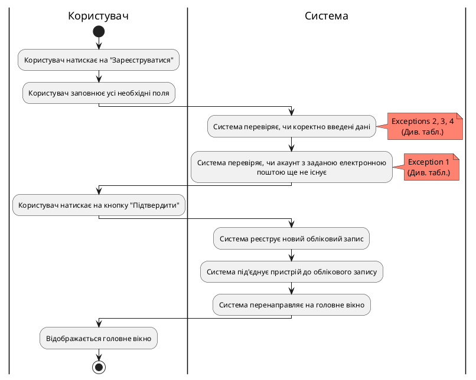
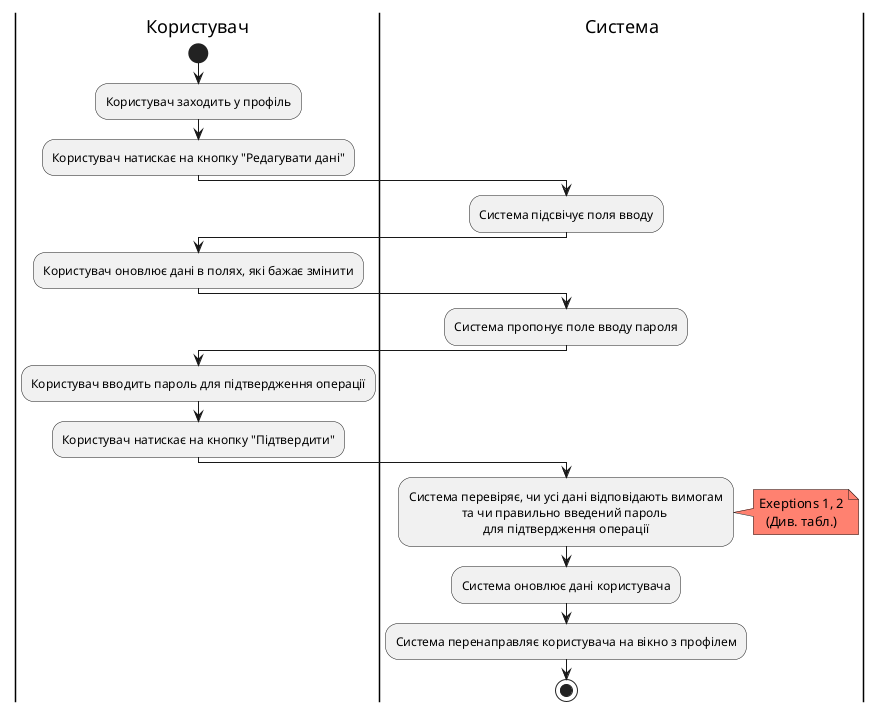
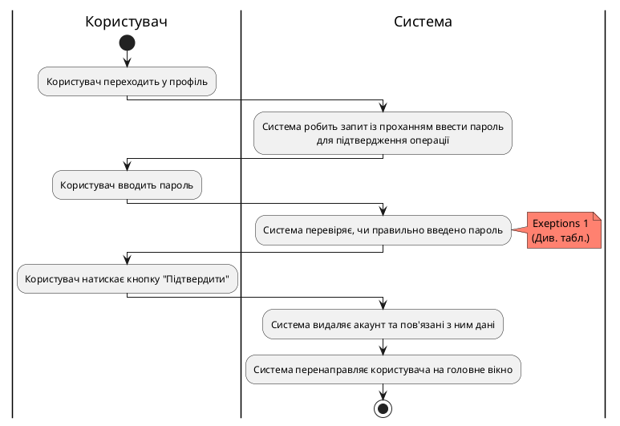

# Розроблення функціональних вимог до системи

## Діаграми активностей

### Діаграма активності для CreateUserAccount
| ID  | CreateUserAccount                                                                                                                                                                                                                                                                                                                                              |
| :------------- |:---------------------------------------------------------------------------------------------------------------------------------------------------------------------------------------------------------------------------------------------------------------------------------------------------------------------------------------------------------------------------------------------------|
| НАЗВА | Створити акаунт користувача                                                                                                                                                                                                                                                                                                                                                                        |
| УЧАСНИКИ | Дослідник, експерт, система                                                                                                                                                                                                                                                                                                                                                                        |
| ПЕРЕДУМОВИ | Користувач попередньо не має зареєстрованого акаунта в системі MESS.                                                                                                                                                                                                                                                                                                                               |
| РЕЗУЛЬТАТ | Реєстрація облікового запису користувача.                                                                                                                                                                                                                                                                                                                                                          |
| ВИКЛЮЧНІ СИТУАЦІЇ | 1. Обліковий запис, зареєстрований за цією поштою, вже існує. 2. Не всі обов'язкові дані заповнені. 3. Пароль не відповідає вимогам. 4. Поля "Пароль" та "Підтвердіть пароль" не збігаються.                                                                                                                                                                                           |

## Діаграма активності для ChangeUserData
| ID  | ChangeUserData                                                                                                                                                                                                                                                                                                                                                                                                                                                                                                                                                                                     |
| :------------- |:------------------------------------------------------------------------------------------------------------------------------------------------------------------------------------------------------------------------------------------------------------------------------------------------------------------------------------------------------------------------------------------------------------------------------------------------------------------------------------------------------------------------------------------------------------------------------------------------------------------------------------|
| НАЗВА | Редагувати дані акаунта                                                                                                                                                                                                                                                                                                                                                                                                                                                                                                                                                                                                             |
| УЧАСНИКИ | Дослідник, експерт, система                                                                                                                                                                                                                                                                                                                                                                                                                                                                                                                                                                                                         |
| ПЕРЕДУМОВИ | Користувач має створений обліковий запис та авторизований у системі.                                                                                                                                                                                                                                                                                                                                                                                                                                                                                                                                                                |
| РЕЗУЛЬТАТ | Оновлення даних облікового запису користувача.                                                                                                                                                                                                                                                                                                                                                                                                                                                                                                                                                                                      |
| ВИКЛЮЧНІ СИТУАЦІЇ | 1. Користувач намагається змінити дані на ті, які не відповідають вимогам. 2. Користувач увів неправильний пароль для підтвердження операції.                                                                                                                                                                                                                                                                                                                                                                                                                                                                                   |
| ОСНОВНИЙ СЦЕНАРІЙ | 1. Користувач заходить у профіль. 2. Користувач натискає на кнопку "Редагувати дані". 3. Користувач оновлює дані в полях, які бажає змінити. 4. Користувач натискає на кнопку "Підтвердити" 5. Користувач вводить пароль для підтвердження операції. 6. Користувач натискає кнопку "Підтвердити". 7. Система підсвічує поля вводу. 8 Система пропонує поле вводу пароля 9. Система перевіряє, чи усі дані відповідають вимогам та чи правильно введений пароль для підтвердження операції. 10. Система оновлює дані користувача. 11. Система перенаправляє користувача на вікно з профілем. |

## Діаграма активності для RemoveUserAccount
| ID  | RemoveUserAccount                                                                                                                                                                                                                                                                                                                                                                               |
| :------------- |:------------------------------------------------------------------------------------------------------------------------------------------------------------------------------------------------------------------------------------------------------------------------------------------------------------------------------------------------------------------------------------------------------------------------------------|
| НАЗВА | Видалити акаунт користувача                                                                                                                                                                                                                                                                                                                                                                                                         |
| УЧАСНИКИ | Дослідник, експерт, система                                                                                                                                                                                                                                                                                                                                                                                                         |
| ПЕРЕДУМОВИ | Користувач має створений обліковий запис та авторизований у системі.  Має бажання видалити обліковий запис.                                                                                                                                                                                                                                                                                                                     |
| РЕЗУЛЬТАТ | Видалення облікового запису користувача.                                                                                                                                                                                                                                                                                                                                                                                            |
| ВИКЛЮЧНІ СИТУАЦІЇ | 1. Користувач увів неправильний пароль для підтвердження операції.                                                                                                                                                                                                                                                                                                                                                                  |

