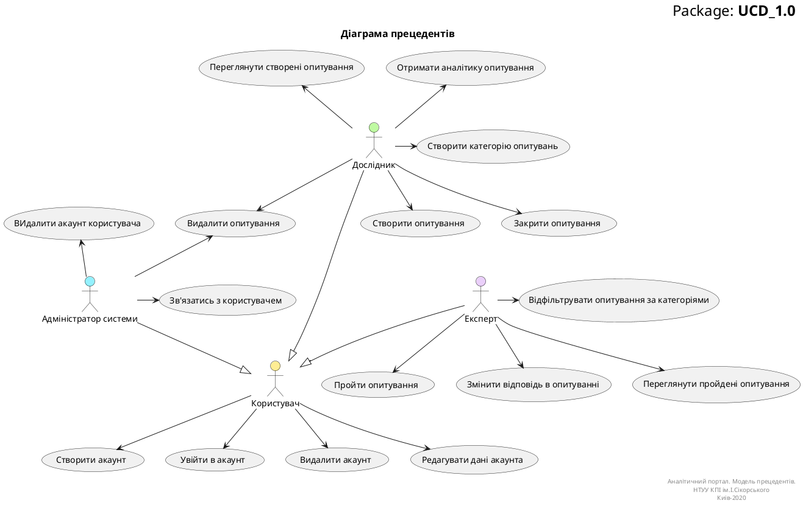

# Розроблення функціональних вимог до системи

## Модель прецедентів

В цьому файлі необхідно перелічити всі документи, розроблені в проекті та дати посилання на них.

*Модель прецедентів повинна містити загальні оглядові діаграми та специфікації прецедентів.*


Вбудовування зображень діаграм здійснюється з використанням сервісу [plantuml.com](https://plantuml.com/). 

В markdown-файлі використовується опис діаграми

```md

<center style="
    border-radius:4px;
    border: 1px solid #cfd7e6;
    box-shadow: 0 1px 3px 0 rgba(89,105,129,.05), 0 1px 1px 0 rgba(0,0,0,.025);
    padding: 1em;"
>

@startuml

    right header
        <font size=24 color=black>Package: <b>UCD_3.0
    end header

    title
        <font size=18 color=black>UC_8. Редагувати конфігурацію порталу
        <font size=16 color=black>Діаграма прецедентів
    end title


    actor "Користувач" as User #eeeeaa
    
    package UCD_1{
        usecase "<b>UC_1</b>\nПереглянути список \nзвітів" as UC_1 #aaeeaa
    }
    
    usecase "<b>UC_1.1</b>\nЗастосувати фільтр" as UC_1.1
    usecase "<b>UC_1.2</b>\nПереглянути метадані \nзвіту" as UC_1.2  
    usecase "<b>UC_1.2.1</b>\nДати оцінку звіту" as UC_1.2.1  
    usecase "<b>UC_1.2.2</b>\nПереглянути інформацію \nпро авторів звіту" as UC_1.2.2
    
    package UCD_1 {
        usecase "<b>UC_4</b>\nВикликати звіт" as UC_4 #aaeeaa
    }
    
    usecase "<b>UC_1.1.1</b>\n Використати \nпошукові теги" as UC_1.1.1  
    usecase "<b>UC_1.1.2</b>\n Використати \nрядок пошуку" as UC_1.1.2
    usecase "<b>UC_1.1.3</b>\n Використати \nавторів" as UC_1.1.3  
    
    
    
    User -> UC_1
    UC_1.1 .u.> UC_1 :extends
    UC_1.2 .u.> UC_1 :extends
    UC_4 .d.> UC_1.2 :extends
    UC_1.2 .> UC_1.2 :extends
    UC_1.2.1 .u.> UC_1.2 :extends
    UC_1.2.2 .u.> UC_1.2 :extends
    UC_1 ..> UC_1.2.2 :extends
    
    
    UC_1.1.1 -u-|> UC_1.1
    UC_1.1.2 -u-|> UC_1.1
    UC_1.1.3 -u-|> UC_1.1
    
    right footer
        Аналітичний портал. Модель прецедентів.
        НТУУ КПІ ім.І.Сікорського
        Киів-2020
    end footer

@enduml

**Діаграма прецедентів**

</center>
```

яка буде відображена наступним чином

<center style="
    border-radius:4px;
    border: 1px solid #cfd7e6;
    box-shadow: 0 1px 3px 0 rgba(89,105,129,.05), 0 1px 1px 0 rgba(0,0,0,.025);
    padding: 1em;"
    >




**Діаграма прецедентів**

</center>

