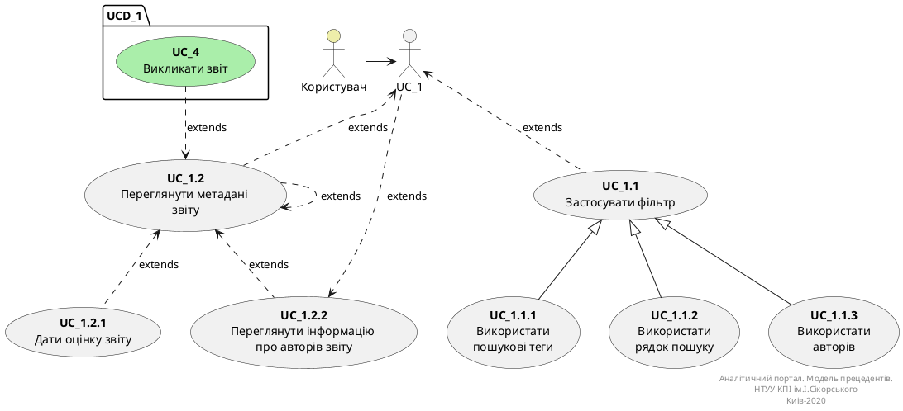

# Розроблення функціональних вимог до системи

### Діаграма use case для незареєстрованного користувача

```plantuml
@startuml

    actor "Користувач" as User #eeeeaa
    
    usecase "<b>UC_1.1</b>\nЗастосувати фільтр" as UC_1.1
    usecase "<b>UC_1.2</b>\nПереглянути метадані \nзвіту" as UC_1.2  
    usecase "<b>UC_1.2.1</b>\nДати оцінку звіту" as UC_1.2.1  
    usecase "<b>UC_1.2.2</b>\nПереглянути інформацію \nпро авторів звіту" as UC_1.2.2
    
    package UCD_1 {
        usecase "<b>UC_4</b>\nВикликати звіт" as UC_4 #aaeeaa
    }
    
    usecase "<b>UC_1.1.1</b>\n Використати \nпошукові теги" as UC_1.1.1  
    usecase "<b>UC_1.1.2</b>\n Використати \nрядок пошуку" as UC_1.1.2
    usecase "<b>UC_1.1.3</b>\n Використати \nавторів" as UC_1.1.3  
    
    
    
    User -> UC_1
    UC_1.1 .u.> UC_1 :extends
    UC_1.2 .u.> UC_1 :extends
    UC_4 .d.> UC_1.2 :extends
    UC_1.2 .> UC_1.2 :extends
    UC_1.2.1 .u.> UC_1.2 :extends
    UC_1.2.2 .u.> UC_1.2 :extends
    UC_1 ..> UC_1.2.2 :extends
    
    
    UC_1.1.1 -u-|> UC_1.1
    UC_1.1.2 -u-|> UC_1.1
    UC_1.1.3 -u-|> UC_1.1
    
    right footer
        Аналітичний портал. Модель прецедентів.
        НТУУ КПІ ім.І.Сікорського
        Киів-2020
    end footer

@enduml
```

**Діаграма прецедентів**

