# Розроблення функціональних вимог до системи
У цьому розділі містяться діаграми прецедентів, зокрема загальна та конкретизовані, і діаграми активностей. 
Діаграми було побудовано з урахуванням розроблених характеристик ділових процесів та функціональних вимог, що містяться в [Запитах зацікавлених осіб](./stakeholders-needs.md)

## Короткий зміст
1. [Діаграма use case для всіх бізнес акторів](#GeneralUseCase)
2. [Діаграма use case для користувача](#UserUseCase)
3. [Діаграма use case дослідника](#ResearcherUseCase)
4. [Діаграма use case для експерта](#ExpertUseCase)
5. [Діаграма use case для адміністратора](#AdminUseCase)
6. [Діаграма активності для CreateUserAccount](#CreateUserAccount)
7. [Діаграма активності для ChangeUserData](#ChangeUserData)
8. [Діаграма активності для RemoveUserAccount](#RemoveUserAccount)
9. [Діаграма активності для CreateSurvey](#CreateSurvey)
10. [Діаграма активності для CloseSurvey](#CloseSurvey)
11. [Діаграма активності для RemoveSurvey](#RemoveSurvey)
12. [Діаграма активності для GetSurveyAnalytics](#GetSurveyAnalytics)
13. [Діаграма активності для ShowCreatedSurveys](#ShowCreatedSurveys)
14. [Діаграма активності для TakeSurvey](#TakeSurvey)
15. [Діаграма активності для ChangeAnswer](#ChangeAnswer)
16. [Діаграма активності для ShowTakenSurveys](#ShowTakenSurveys)

## Діаграми прецедентів бізнес акторів

**Діаграма прецидентів _(діаграма use case_)** - діаграма, що показує різноманітні сценарії взаємодії 
між акторами (користувачами) та прецидентами (випадками використання). [[1]]((https://lvivqaclub.blogspot.com/2008/10/use-case-uml-diagram.html)) [[2]](https://dou.ua/forums/topic/40575/)

### Діаграма use case для всіх бізнес акторів

### Діаграма use case для користувача

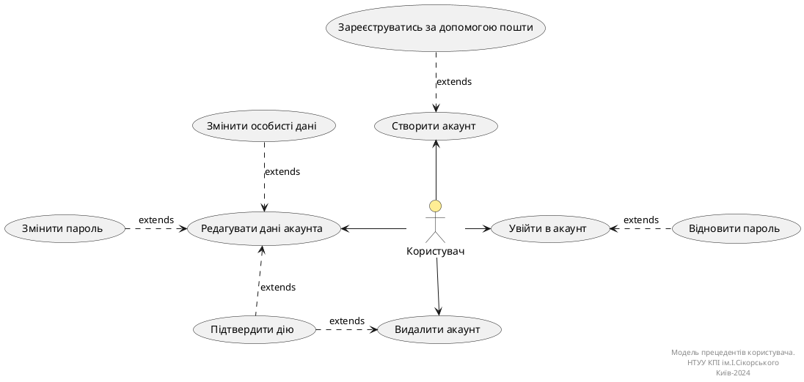

### Діаграма use case дослідника

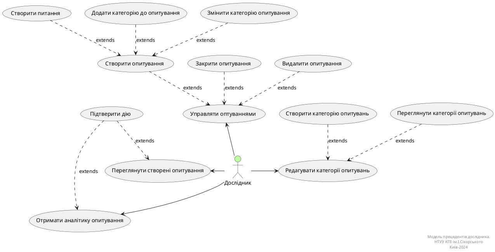

### Діаграма use case для експерта

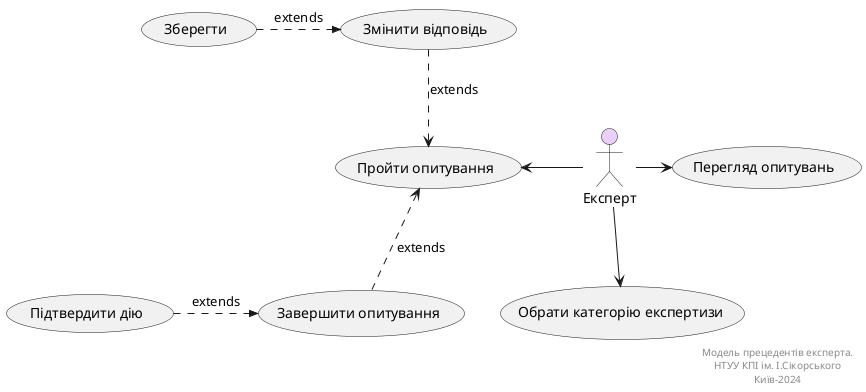

### Діаграма use case для адміністратора

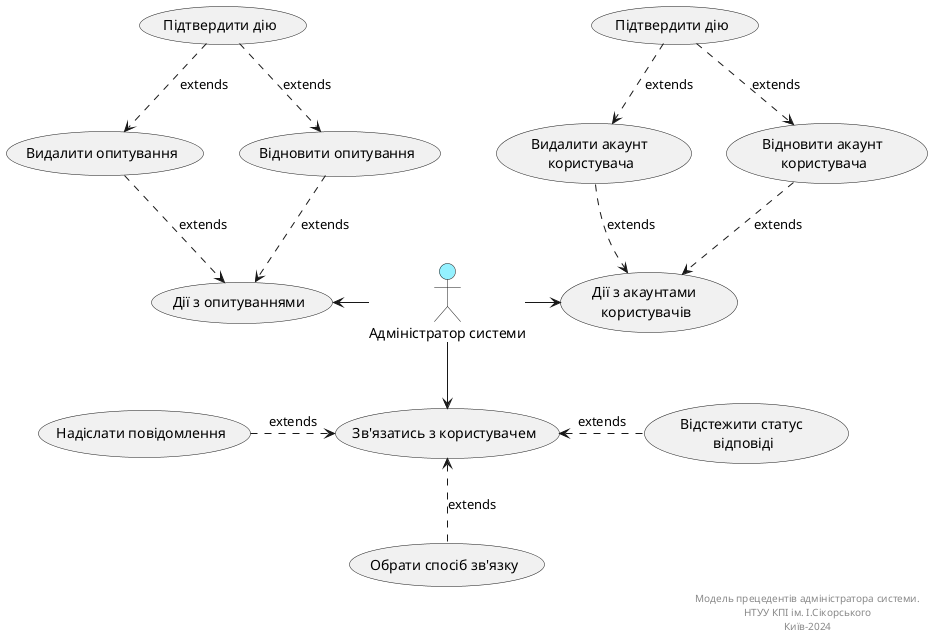

## Діаграми діяльностей
**Діаграма діяльності _(activity діаграма)_** - діаграма, що візуалізує процес використання та ілюструє потік повідомлень від 
однієї дії до іншої. [[2]](https://dou.ua/forums/topic/40575/)

### Діаграма діяльності для CreateUserAccount
| ID  | BUC.01.01                                                                                                                                                                                                                         |
| :------------- |:----------------------------------------------------------------------------------------------------------------------------------------------------------------------------------------------------------------------------------|
| НАЗВА | Створити акаунт користувача                                                                                                                                                                                                       |
| УЧАСНИКИ | Користувач, система                                                                                                                                                                                                               |
| ПЕРЕДУМОВИ | Користувач попередньо не має зареєстрованого акаунта в системі MESS.                                                                                                                                                              |
| РЕЗУЛЬТАТ | Новий обліковий запис користувача.                                                                                                                                                                                                |
| ВИКЛЮЧНІ СИТУАЦІЇ | EX.01.01 Обліковий запис, зареєстрований за цією поштою, вже існує. EX.01.02 Не всі обов'язкові дані заповнені. EX.01.03 Пароль не відповідає вимогам. EX.01.04 Поля "Пароль" та "Підтвердіть пароль" не збігаються. |

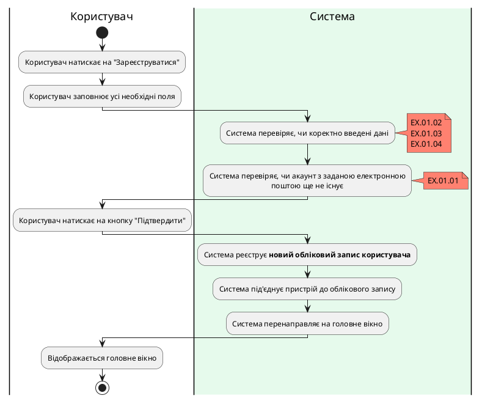

### Діаграма діяльності для ChangeUserData

| ID  | ChangeUserData                                                                                                                                                                                                                                                                                                                                                                                                                                                                                                                                                                                    |
| :------------- |:------------------------------------------------------------------------------------------------------------------------------------------------------------------------------------------------------------------------------------------------------------------------------------------------------------------------------------------------------------------------------------------------------------------------------------------------------------------------------------------------------------------------------------------------------------------------------------------------------------------------------------|
| НАЗВА | Редагувати дані акаунта                                                                                                                                                                                                                                                                                                                                                                                                                                                                                                                                                                                                             |
| УЧАСНИКИ | Користувач, система                                                                                                                                                                                                                                                                                                                                                                                                                                                                                                                                                                                                         |
| ПЕРЕДУМОВИ | Користувач має створений обліковий запис та авторизований у системі.                                                                                                                                                                                                                                                                                                                                                                                                                                                                                                                                                                |
| РЕЗУЛЬТАТ | Оновлення даних облікового запису користувача.                                                                                                                                                                                                                                                                                                                                                                                                                                                                                                                                                                                      |
| ВИКЛЮЧНІ СИТУАЦІЇ | 1. Користувач намагається змінити дані на ті, які не відповідають вимогам. 2. Користувач увів неправильний пароль для підтвердження операції.                                                                                                                                                                                                                                                                                                                                                                                                                                                                                   |

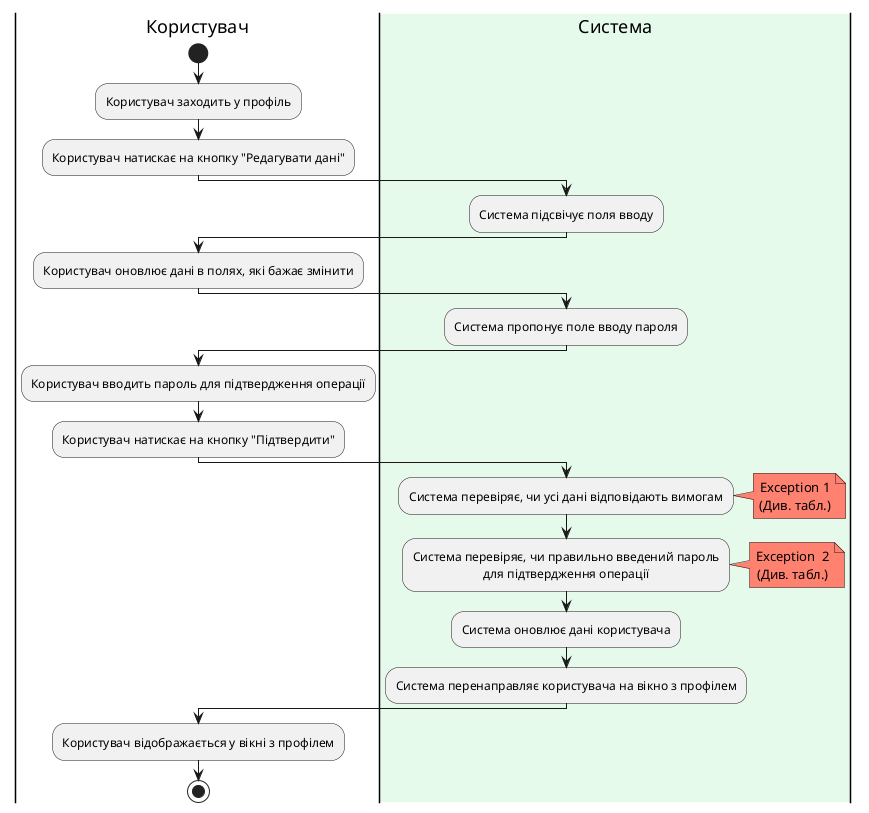

### Діаграма діяльності для RemoveUserAccount
| ID  | RemoveUserAccount                                                                                                                                                                                                                                                                                                                                                                              |
| :------------- |:------------------------------------------------------------------------------------------------------------------------------------------------------------------------------------------------------------------------------------------------------------------------------------------------------------------------------------------------------------------------------------------------------------------------------------|
| НАЗВА | Видалити акаунт користувача                                                                                                                                                                                                                                                                                                                                                                                                         |
| УЧАСНИКИ | Користувач, система                                                                                                                                                                                                                                                                                                                                                                                                         |
| ПЕРЕДУМОВИ | Користувач має створений обліковий запис та авторизований у системі.  Має бажання видалити обліковий запис.                                                                                                                                                                                                                                                                                                                     |
| РЕЗУЛЬТАТ | Видалення облікового запису користувача.                                                                                                                                                                                                                                                                                                                                                                                            |
| ВИКЛЮЧНІ СИТУАЦІЇ | 1. Користувач увів неправильний пароль для підтвердження операції.                                                                                                                                                                                                                                                                                                                                                                  |

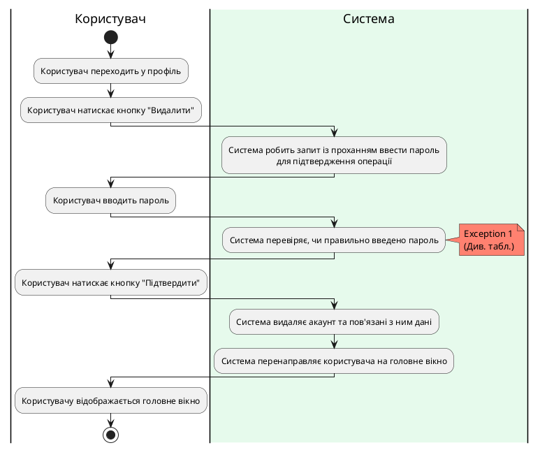

### Діаграма діяльності для CreateSurvey

| ID  | CreateSurvey                                                                                                                                                   |
| :------------- |:----------------------------------------------------------------------------------------------------------------------------------------------------------------------------------------------|
| НАЗВА | Створити опитування                                                                                                                                                                           |
| УЧАСНИКИ | Дослідник, система                                                                                                                                                                            |
| ПЕРЕДУМОВИ | Дослідник має намір створити опитування та вже авторизований у системі.                                                                                                                       |
| РЕЗУЛЬТАТ | Створення опитування.                                                                                                                                                                         |
| ВИКЛЮЧНІ СИТУАЦІЇ | 1. Дослідник не заповнив усі поля запитань та варіантів відповідей, що додав. 2. Запитання містить однакові варіанти відповідей. 3. Дослідник не додав жодного питання до опитування. |

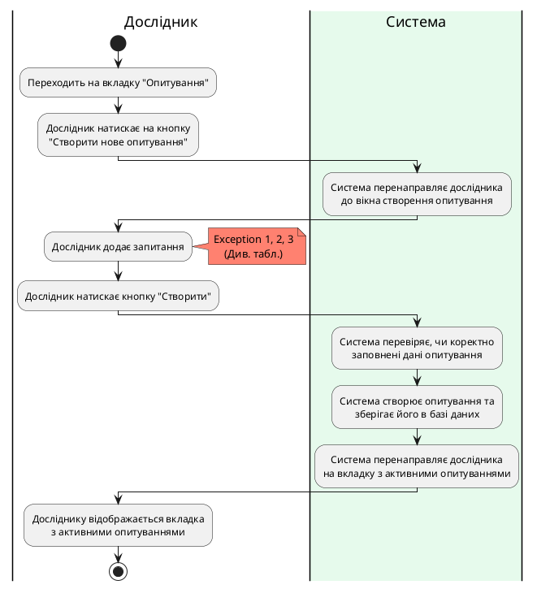

### Діаграма діяльності для CloseSurvey

| ID                |CloseSurvey                                                                                                                                     |
|:------------------|:--------------------------------------------------------------------------------------------------------------------------------------------------------------------------------|
| НАЗВА             | Закрити опитування                                                                                                                                                              |
| УЧАСНИКИ          | Дослідник, система                                                                                                                                                              |
| ПЕРЕДУМОВИ        | Дослідник вже має створене опитування, яке хоче закрити.                                                                                                                        |
| РЕЗУЛЬТАТ         | Закриття опитування (більше не є можливим для проходження).                                                                                                                     |
| ВИКЛЮЧНІ СИТУАЦІЇ | 1. При запиті "Ви точно бажаєте закрити опитування?" обрати варіант "Ні". 2. Швидко натискає кнопку другий раз до того, як запит після першого натискання встиг обробитися. |

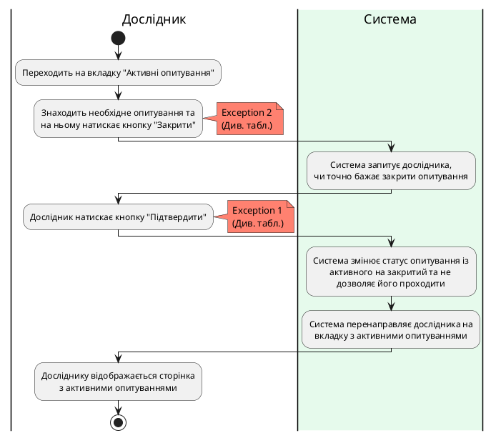

### Діаграма діяльності для RemoveSurvey

| ID  | RemoveSurvey                                                                                                                                 |
| :------------- |:---------------------------------------------------------------------------------------------------------------------------------------------------------------------------------|
| НАЗВА | Видалити опитування                                                                                                                                                              |
| УЧАСНИКИ | Дослідник, система                                                                                                                                                               |
| ПЕРЕДУМОВИ | Дослідник вже має закрите опитування та бажання його видалити.                                                                                                                   |
| РЕЗУЛЬТАТ | Видалення опитування.                                                                                                                                                            |
| ВИКЛЮЧНІ СИТУАЦІЇ | 1. При запиті "Ви точно бажаєте видалити опитування?" обрати варіант "Ні". 2. Швидко натискає кнопку другий раз до того, як запит після першого натискання встиг обробитися. |

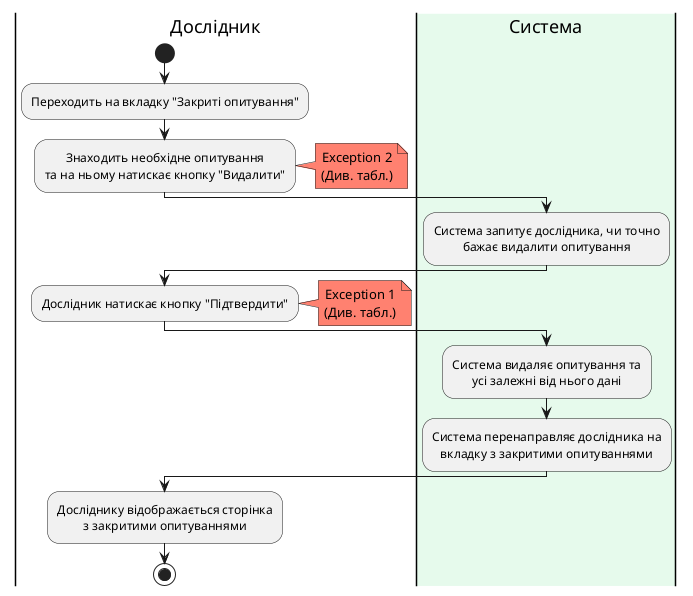

### Діаграма діяльності для GetSurveyAnalytics

| ID  | GetSurveyAnalytics                                       |
| :------------- |:-------------------------------------------------------------------------------------------------|
| НАЗВА | Отримати аналітику опитування                                                                    |
| УЧАСНИКИ | Дослідник, система                                                                               |
| ПЕРЕДУМОВИ | Дослідник вже має створене опитування.                                                           |
| РЕЗУЛЬТАТ | Отримується аналітика за результатами опитування.                                                |
| ВИКЛЮЧНІ СИТУАЦІЇ | 1. Багаторазове швидке натискання на кнопку "Аналітика". 2. Не вдалося отримати дані з бази. |

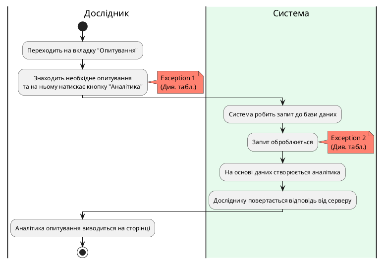

### Діаграма діяльності для ShowCreatedSurveys

| ID  | ShowCreatedSurveys                                                                                                                                 |
| :------------- |:------------------------------------------------------------------------------------------------------------------------------------------------------------------------------------------|
| НАЗВА | Показати створені опитування                                                                                                                                                              |
| УЧАСНИКИ | Дослідник, система                                                                                                                                                                        |
| ПЕРЕДУМОВИ | Дослідник вже авторизований у системі.                                                                                                                                                    |
| РЕЗУЛЬТАТ | Показуються усі створені опитування.                                                                                                                                                      |
| ВИКЛЮЧНІ СИТУАЦІЇ | 1. У користувача зник інтернет. 2. Не вдалося отримати дані з бази.  3. Запит на створення нового опитування не встиг обробитись, тому щойно створене опитування не відображається. |

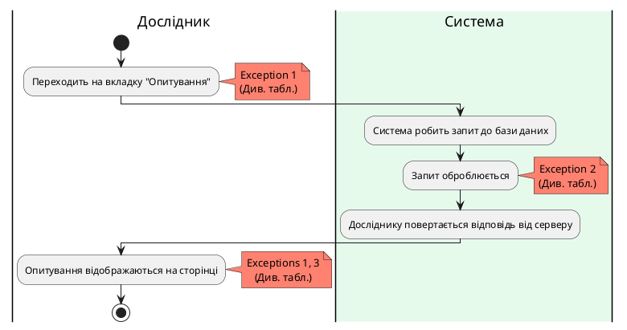

### Діаграма діяльності для TakeSurvey
| ID  | TakeSurvey                                                                                                                                                                                                                                 |
| :------------- |:------------------------------------------------------------------------------------------------------------------------------------------------------------------------------------------------------------------------------------------------------------------------|
| НАЗВА | Отримати аналітику опитування                                                                                                                                                                                                                                           |
| УЧАСНИКИ | Експерт, система                                                                                                                                                                                                                                                        |
| ПЕРЕДУМОВИ | Експерт має бути зареєстрований у системі.                                                                                                                                                                                                                              |
| РЕЗУЛЬТАТ | Експерту показується опитування, та він може його проходити.                                                                                                                                                                                                            |
| ВИКЛЮЧНІ СИТУАЦІЇ | 1. Експерт двічі натиснув на кнопку "Почати опитування".  2. У користувача зник інтернет  3. Користувач випадково оновив сторінку                                                                                                                                 |

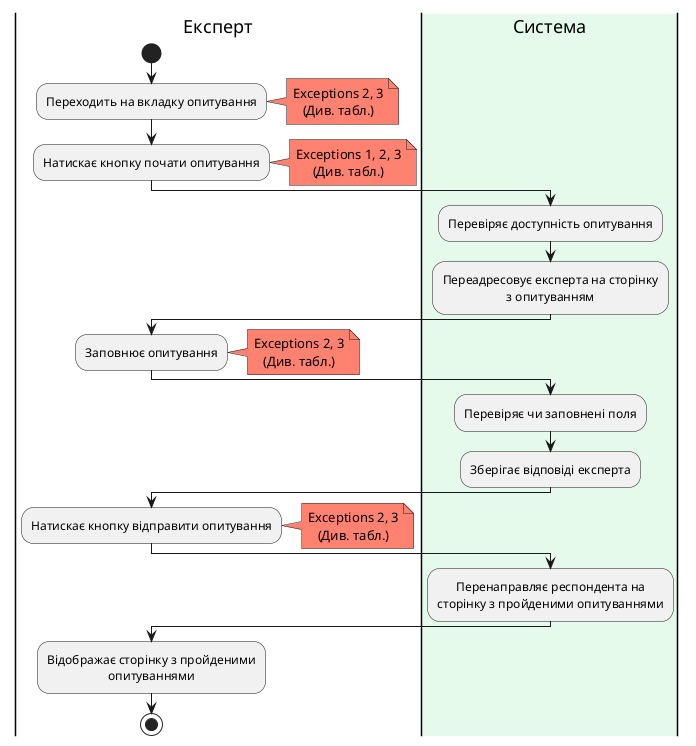

### Діаграма діяльності для ChangeAnswer
| ID  | ChangeAnswer                                                                                                                                    |
| :------------- |:-------------------------------------------------------------------------------------------------------------------------------------------------------------------------------|
| НАЗВА | Отримати аналітику опитування                                                                                                                                                  |
| УЧАСНИКИ | Експерт, система                                                                                                                                                               |
| ПЕРЕДУМОВИ | Ця можливість повинна бути дозволена автором опитування.                                                                                                                       |
| РЕЗУЛЬТАТ | Відповідь експерта змінюється.                                                                                                                                                 |
| ВИКЛЮЧНІ СИТУАЦІЇ | 1. У експерта зник інтернет.  2. Експерт випадково оновив сторінку.                                                                                                         |

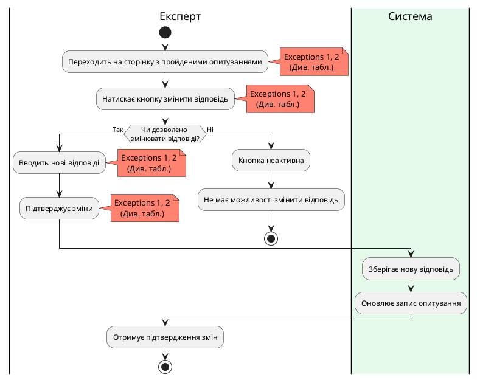

### Діаграма діяльності для ShowTakenSurveys

| ID  | ShowTakenSurveys  |
| :------------- |:-----------------------------------------------------|
| НАЗВА | Показ пройдених опитуваннь.                          |
| УЧАСНИКИ | Експерт, система                                     |
| ПЕРЕДУМОВИ | Експерт авторизований у систему.                     |
| РЕЗУЛЬТАТ | Експерту виводяться всі пройдені опитування у вікні. |
| ВИКЛЮЧНІ СИТУАЦІЇ | 1. Помилка на сервері.                               |

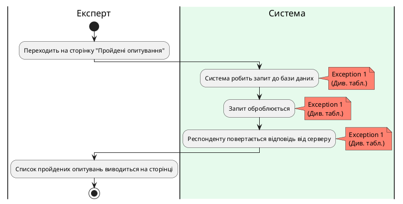

## Посилання

1. [Діаграми Прецедентів (Use Case UML Diagram)](https://lvivqaclub.blogspot.com/2008/10/use-case-uml-diagram.html)
2. [Як будувати UML-діаграми. Розбираємо три найпопулярніші варіанти](https://dou.ua/forums/topic/40575/)