# Розроблення функціональних вимог до системи
У цьому розділі містяться діаграми прецедентів, зокрема загальна та конкретизовані, і діаграми активностей. 
Діаграми було побудовано з урахуванням розроблених характеристик ділових процесів та функціональних вимог, що містяться в [Запитах зацікавлених осіб](./stakeholders-needs.md)

## Короткий зміст
1. [Діаграма use case для всіх бізнес акторів](#GeneralUseCase)
2. [Діаграма use case для користувача](#UserUseCase)
3. [Діаграма use case дослідника](#ResearcherUseCase)
4. [Діаграма use case для експерта](#ExpertUseCase)
5. [Діаграма use case для адміністратора](#AdminUseCase)
6. [Діаграма активності для "Створити акаунт користувача"](#CreateUserAccount)
7. [Діаграма активності для "Редагувати дані акаунта"](#ChangeUserData)
8. [Діаграма активності для "Видалити акаунт користувача"](#RemoveUserAccount)
9. [Діаграма активності для "Створити опитування"](#CreateSurvey)
10. [Діаграма активності для "Закрити опитування"](#CloseSurvey)
11. [Діаграма активності для "Видалити опитування"](#RemoveSurvey)
12. [Діаграма активності для "Отримати аналітику опитування"](#GetSurveyAnalytics)
13. [Діаграма активності для "Показати створені опитування"](#ShowCreatedSurveys)
14. [Діаграма активності для "Пройти опитування"](#TakeSurvey)
15. [Діаграма активності для "Змінити відповіді"](#ChangeAnswer)
16. [Діаграма активності для "Показати пройдені опитування"](#ShowTakenSurveys)

## Діаграми прецедентів бізнес акторів

**Діаграма прецидентів _(діаграма use case_)** - діаграма, що показує різноманітні сценарії взаємодії 
між акторами (користувачами) та прецидентами (випадками використання). [[1]]((https://lvivqaclub.blogspot.com/2008/10/use-case-uml-diagram.html)) [[2]](https://dou.ua/forums/topic/40575/)

### Діаграма use case для всіх бізнес акторів

### Діаграма use case для користувача

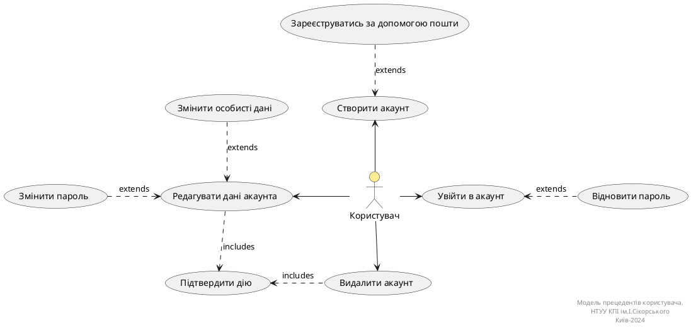

### Діаграма use case дослідника

### Діаграма use case для експерта

### Діаграма use case для адміністратора

## Діаграми діяльностей
**Діаграма діяльності _(activity діаграма)_** - діаграма, що візуалізує процес використання та ілюструє потік повідомлень від 
однієї дії до іншої. [[2]](https://dou.ua/forums/topic/40575/)

### Діаграма діяльності для "Створити акаунт користувача"
| ID  | BUC.01.01                                                                                                                                                                                                                         |
| :------------- |:----------------------------------------------------------------------------------------------------------------------------------------------------------------------------------------------------------------------------------|
| НАЗВА | Створити акаунт користувача                                                                                                                                                                                                       |
| УЧАСНИКИ | Користувач, система                                                                                                                                                                                                               |
| ПЕРЕДУМОВИ | Користувач попередньо не має зареєстрованого акаунта в системі MESS.                                                                                                                                                              |
| РЕЗУЛЬТАТ | Новий обліковий запис користувача.                                                                                                                                                                                                |
| ВИКЛЮЧНІ СИТУАЦІЇ | EX.01.01 Обліковий запис, зареєстрований за цією поштою, вже існує. EX.01.02 Не всі обов'язкові дані заповнені. EX.01.03 Пароль не відповідає вимогам. EX.01.04 Поля "Пароль" та "Підтвердіть пароль" не збігаються. |

### Діаграма діяльності для "Редагувати дані акаунта"

| ID  | BUC.01.02                                                                                                                                                     |
| :------------- |:--------------------------------------------------------------------------------------------------------------------------------------------------------------|
| НАЗВА | Редагувати дані акаунта                                                                                                                                       |
| УЧАСНИКИ | Користувач, система                                                                                                                                           |
| ПЕРЕДУМОВИ | Користувач має створений обліковий запис та авторизований у системі.                                                                                          |
| РЕЗУЛЬТАТ | Оновлені дані облікового запису.                                                                                                                              |
| ВИКЛЮЧНІ СИТУАЦІЇ | EX.01.05 Користувач намагається змінити дані на ті, які не відповідають вимогам. EX.01.06 Користувач увів неправильний пароль для підтвердження операції. |

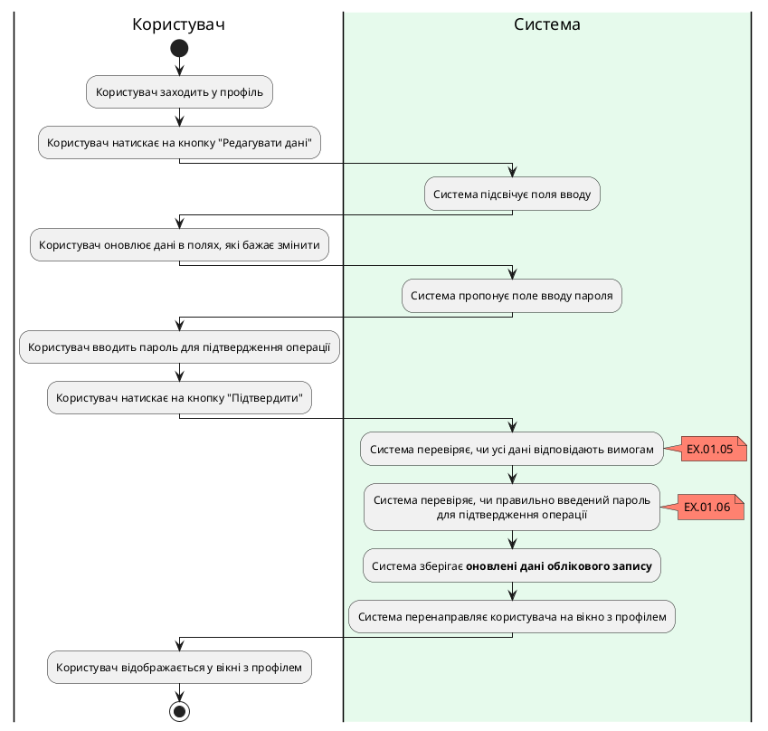

### Діаграма діяльності для "Видалити акаунт користувача"
| ID  | BUC.01.03                                                                                                     |
| :------------- |:--------------------------------------------------------------------------------------------------------------|
| НАЗВА | Видалити акаунт користувача                                                                                   |
| УЧАСНИКИ | Користувач, система                                                                                           |
| ПЕРЕДУМОВИ | Користувач має створений обліковий запис та авторизований у системі. |
| РЕЗУЛЬТАТ | Видалення облікового запису користувача.                                                                      |
| ВИКЛЮЧНІ СИТУАЦІЇ | EX.01.06 Користувач увів неправильний пароль для підтвердження операції.                                      |

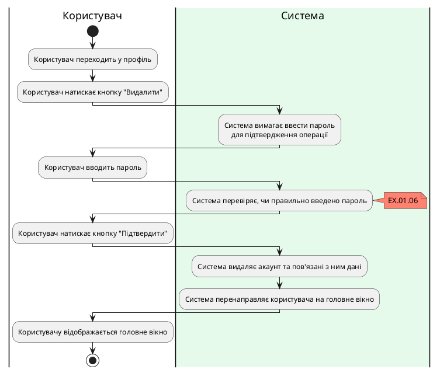

### Діаграма діяльності для "Створити опитування"

| ID  | BUC.01.04                                                                                                                                                                                                       |
| :------------- |:----------------------------------------------------------------------------------------------------------------------------------------------------------------------------------------------------------------|
| НАЗВА | Створити опитування                                                                                                                                                                                             |
| УЧАСНИКИ | Дослідник, система                                                                                                                                                                                              |
| ПЕРЕДУМОВИ | Дослідник вже авторизований у системі.                                                                                                                                        |
| РЕЗУЛЬТАТ | Нове опитування.                                                                                                                                                                                                |
| ВИКЛЮЧНІ СИТУАЦІЇ | EX.01.07 Дослідник не заповнив усі поля запитань та варіантів відповідей, що додав. EX.01.08 Запитання містить однакові варіанти відповідей. EX.01.09 Дослідник не додав жодного питання до опитування. |

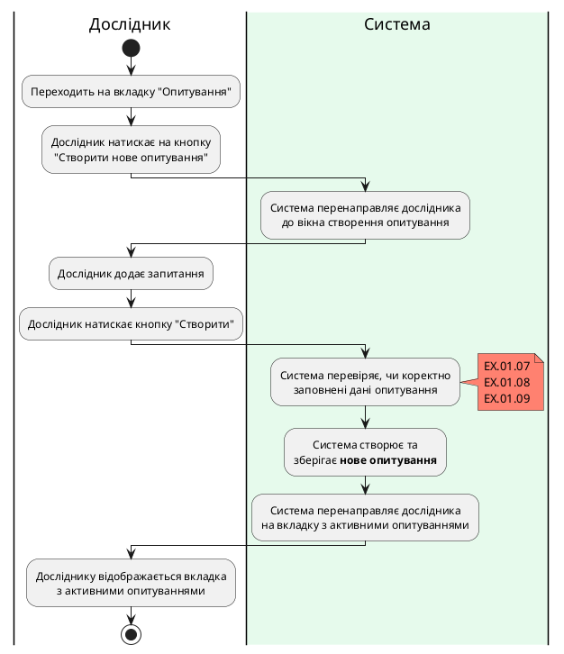

### Діаграма діяльності для "Закрити опитування"

| ID                | BUC.02.01                                                                                                                                                                                   |
|:------------------|:--------------------------------------------------------------------------------------------------------------------------------------------------------------------------------------------|
| НАЗВА             | Закрити опитування                                                                                                                                                                          |
| УЧАСНИКИ          | Дослідник, система                                                                                                                                                                          |
| ПЕРЕДУМОВИ        | Дослідник вже має створене опитування.                                                                                                                               |
| РЕЗУЛЬТАТ         | Закрите опитування (більше не є можливим для проходження).                                                                                                                                  |
| ВИКЛЮЧНІ СИТУАЦІЇ | EX.02.01 При запиті "Ви точно бажаєте закрити опитування?" обрати варіант "Ні". EX.02.02 Швидко натискає кнопку другий раз до того, як запит після першого натискання встиг обробитися. |

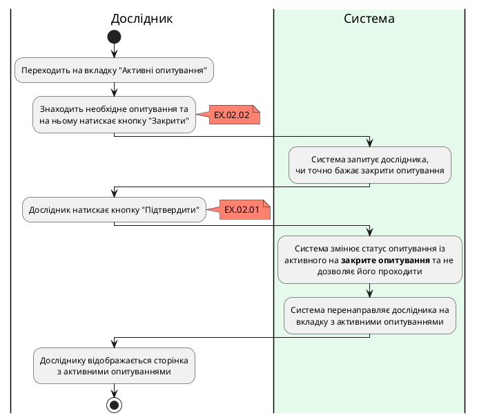

### Діаграма діяльності для "Видалити опитування"

| ID  | BUC.02.02                                                                                                                                                                                    |
| :------------- |:---------------------------------------------------------------------------------------------------------------------------------------------------------------------------------------------|
| НАЗВА | Видалити опитування                                                                                                                                                                          |
| УЧАСНИКИ | Дослідник, система                                                                                                                                                                           |
| ПЕРЕДУМОВИ | Дослідник вже має закрите опитування.                                                                                                                                |
| РЕЗУЛЬТАТ | Видалення опитування.                                                                                                                                                                        |
| ВИКЛЮЧНІ СИТУАЦІЇ | EX.02.02 Швидко натискає кнопку другий раз до того, як запит після першого натискання встиг обробитися. EX.02.03 При запиті "Ви точно бажаєте видалити опитування?" обрати варіант "Ні". |

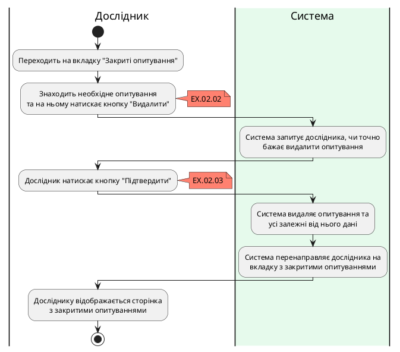

### Діаграма діяльності для "Отримати аналітику опитування"

| ID  | BUC.03.01                                                                                                    |
| :------------- |:-------------------------------------------------------------------------------------------------------------|
| НАЗВА | Отримати аналітику опитування                                                                                |
| УЧАСНИКИ | Дослідник, система                                                                                           |
| ПЕРЕДУМОВИ | Дослідник вже має створене опитування.                                                                       |
| РЕЗУЛЬТАТ | Аналітика опитування                                                                                         |
| ВИКЛЮЧНІ СИТУАЦІЇ | EX.03.01 Багаторазове швидке натискання на кнопку "Аналітика". EX.03.02 Не вдалося отримати дані з бази. |

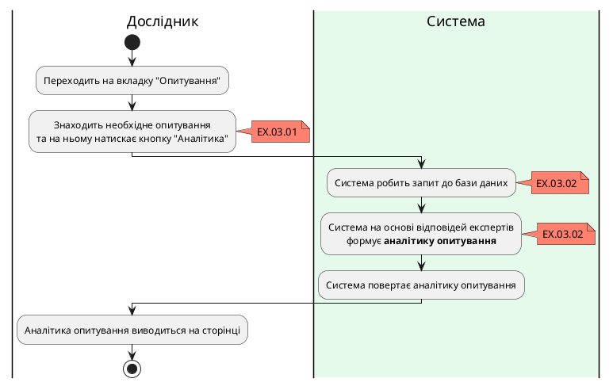

### Діаграма діяльності для "Показати створені опитування"

| ID  | BUC.02.03                                                                                                                                                                                                           |
| :------------- |:--------------------------------------------------------------------------------------------------------------------------------------------------------------------------------------------------------------------|
| НАЗВА | Показати створені опитування                                                                                                                                                                                        |
| УЧАСНИКИ | Дослідник, система                                                                                                                                                                                                  |
| ПЕРЕДУМОВИ | Дослідник вже авторизований у системі.                                                                                                                                                                              |
| РЕЗУЛЬТАТ | Список створених опитувань.                                                                                                                                                                                         |
| ВИКЛЮЧНІ СИТУАЦІЇ | EX.02.04 У користувача зник інтернет. EX.02.05 Не вдалося отримати дані з бази.  EX.02.06 Запит на створення нового опитування система не встигла обробити, тому щойно створене опитування не відображається. |

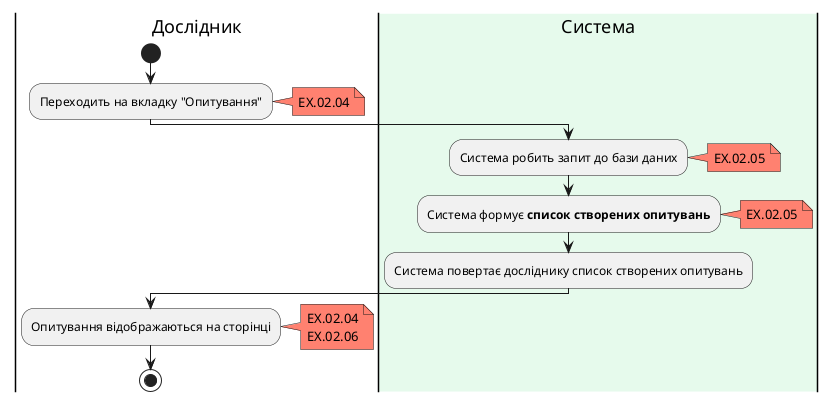

### Діаграма діяльності для "Пройти опитування"
| ID  | BUC.02.04                                                                                                                                                  |
| :------------- |:-----------------------------------------------------------------------------------------------------------------------------------------------------------|
| НАЗВА | Пройти опитування                                                                                                                                          |
| УЧАСНИКИ | Експерт, система                                                                                                                                           |
| ПЕРЕДУМОВИ | Експерт має бути зареєстрований у системі.                                                                                                                 |
| РЕЗУЛЬТАТ | Відповіді експерта.                                                                                                                                        |
| ВИКЛЮЧНІ СИТУАЦІЇ | EX.02.04 У користувача зник інтернет. EX.02.07 Експерт двічі натиснув на кнопку "Почати опитування".  EX.02.08 Користувач випадково оновив сторінку. |

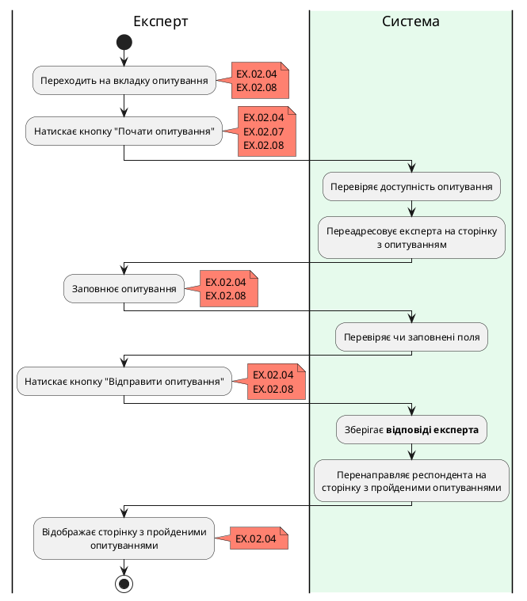

### Діаграма діяльності для "Змінити відповіді"
| ID  | BUC.02.05                                                              |
| :------------- |:-----------------------------------------------------------------------|
| НАЗВА | Змінити відповіді                                                      |
| УЧАСНИКИ | Експерт, система                                                       |
| ПЕРЕДУМОВИ | Ця можливість повинна бути дозволена автором опитування.               |
| РЕЗУЛЬТАТ | Оновлені відповіді експерта                                            |
| ВИКЛЮЧНІ СИТУАЦІЇ | EX.02.04 У користувача зник інтернет.  EX.02.08 Користувач випадково оновив сторінку. |

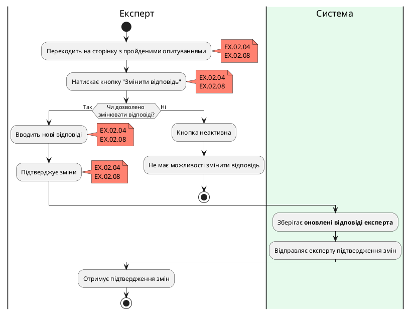

### Діаграма діяльності для "Показати пройдені опитування"

| ID  | BUC.02.06                                 |
| :------------- |:------------------------------------------|
| НАЗВА | Показати пройдені опитування              |
| УЧАСНИКИ | Експерт, система                          |
| ПЕРЕДУМОВИ | Експерт авторизований у системі.          |
| РЕЗУЛЬТАТ | Список пройдених опитувань.               |
| ВИКЛЮЧНІ СИТУАЦІЇ | EX.02.05 Не вдалося отримати дані з бази. |

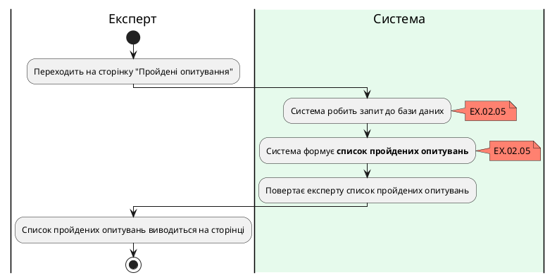

## Посилання

1. [Діаграми Прецедентів (Use Case UML Diagram)](https://lvivqaclub.blogspot.com/2008/10/use-case-uml-diagram.html)
2. [Як будувати UML-діаграми. Розбираємо три найпопулярніші варіанти](https://dou.ua/forums/topic/40575/)