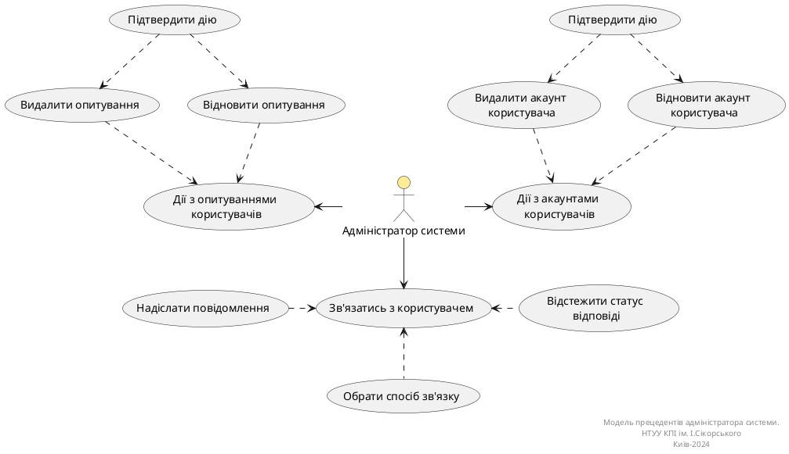

# Розроблення функціональних вимог до системи

### Діаграма use case для незареєстрованного користувача

**Діаграма прецедентів користувача**

### Діаграма use case для адміністратора

Діаграма прецедентів адміністратора

